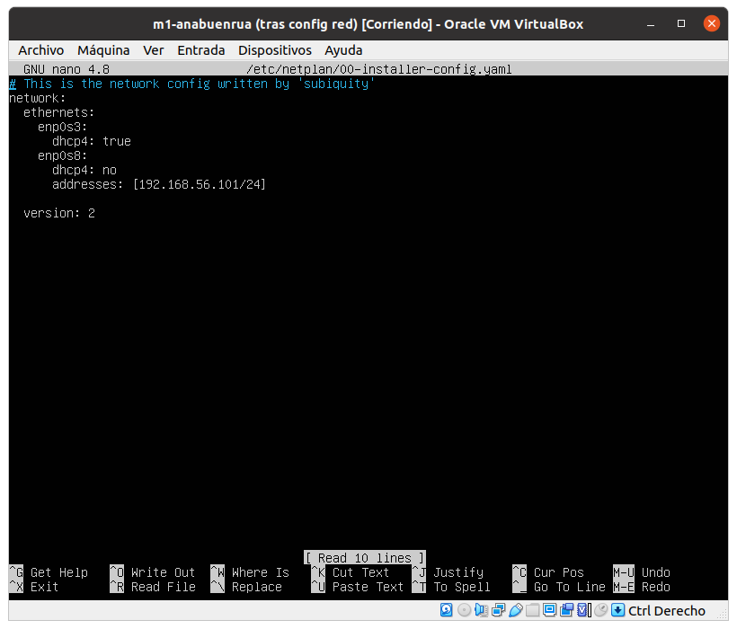
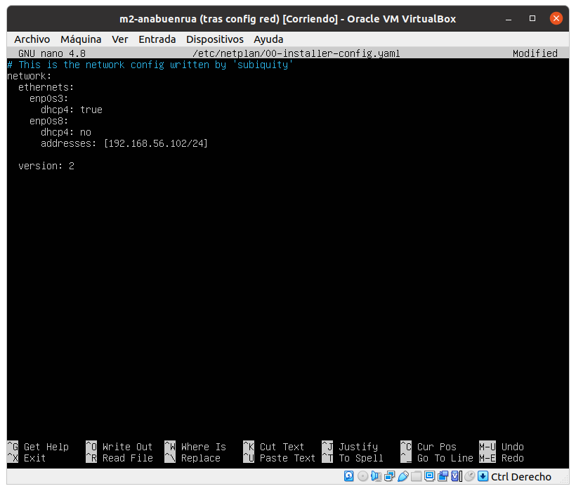
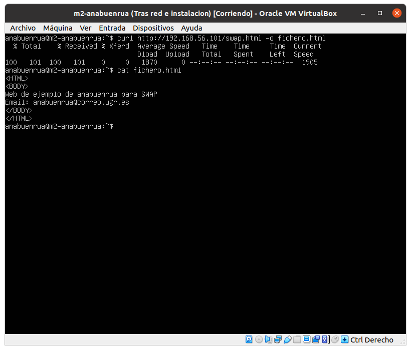

# Práctica 1

> Por: Mapachana

## Instalación de las máquinas virtuales

Comenzamos descargando la iso de Ubuntu Server 20.04.4 LTS.

Ahora, abrimos VirtualBox y creamos una nueva máquina virtual pulsando en Nueva.

Ahora, procedemos a crear la primera máquina virtual con 1GB de RAM y 10GB de disco duro dinámico.

Añadimos un disco duro dinámico: 

Ahora añadimos la iso pulsando con clic derecho en configuración y a añadir unidad óptica:

La máquina virtual ya está lista para el arranque.

Procedemos a lanzarla y configuramos la instalación:

Primero seleccionamos el idioma: español.

A continuación pulsamos en detectar teclado y nos selecciona la variante española del mismo.

Dejamos la configuración por defecto en los siguientes pasos.

Introduzco mi nombre y mi usuario de la ugr con contraseña "Swap1234".

Una vez terminada la instalación le damos a reiniciar ahora y comprobamos que en efecto la máquina funciona.

Repetimos este mismo procedimiento con la otra máquina virtual.

## Configuración de la red

Para disponer de conexión a internet y poder conectar las máquinas entre sí y con el anfitrión vamos a añadir un adaptador de red en modo NAT y otro adaptador de red en solo-anfitrión.

Comenzamos con la red NAT

A continuación, como no tengo configurada la red solo-anfitrión en mi virtual box voy a crear una, en `archivo->Administrador de red anfitrión`:

Y ahora, en nuestra máquina virtual configuramos la red solo-anfitrión:

Arrancamos la máquina virtual para completar la configuración de la red editando el fichero `/etc/netplan/00-installer-config.yaml`:

Y, finalmente, ejecutamos el comando `sudo netplan apply` para hacer efectivos los cambios:

Comprobamos con el comando `ip address show` que la configuración se ha realizado correctamente:

Finalmente comprobamos mediante ping que podemos conectarnos entre las máquinas. La dirección ip de la máquina m1 es `192.168.56.101` mientras que la de la máquina m2 es `192.168.56.102`.

Realizamos ping de m1 a m2 y después de m2 a m1, confirmando así que la red está bien configurada.

### Configuración avanzada

Para configurar la red, de nuevo se hará modificando el fichero `/etc/netplan/00-installer-config.yaml`. Vamos a asignar las direcciones IPs a mano, 192.168.56.101 a m1, y 192.168.56.102 a m2, asignando la máscara 255.255.255.0, por lo que añadimos un /24 al final de las ips.

Hacemos los cambios efectivos con `sudo netplan apply`.

Con `ip address show` confirmamos que los cambios se han hecho correctamente y con ping o ssh de nuevo comprobamos que podemos conectarnos entre las máquinas.

## Instalando los programas necesarios

Primero vamos a instalar LAMP, para ello ejecutamos el comando `sudo apt-get install apache2 mysql-server mysql-client`.

Comprobamos la versión mediante el comando `apache2 -v` y comprobamos si está en ejecución con `sudo service apache2 status`:

Finalmente activamos la cuenta de root mediante el comando `sudo passwd root`:

Repetimos toda esta configuración e instalación en la otra máquina virtual a crear.

## Apache

Comenzamos creando el archivo `swap.html` en el directorio `/var/www/html/`.

Y ahora, desde la máquina m2 accedemos a esta página con curl:

Análogamente se puede comprobar cambiando los roles de las máquinas m1 y m2.

También podemos acceder desde el navegador usando la dirección ip de la máquina virtual.

### Cambiando puertos

Vamos a cambiar el puerto de escucha al 8081. Para ello comenzamos modificando el fichero `/etc/apache2/ports.conf` añadiendo `Listen 8081`:

A continuación modificamos el archivo `/etc/apache2/sites-enabled/000-default.conf`:

Comprobamos que está todo bien con `sudo apache2ctl configtest`, que nos devuelve `Syntax OK`, por lo que reiniciamos el servicio apache con `sudo systemctl restart apache2` y comprobamos que el cambio se ha hecho correctamente accediendo a la dirección ip especificando el puerto 8081:

### Directorios virtuales

En `/var/www` creamos la carpeta `prueba/public_html`:

Y en este directorio creamos el archivo `index.html`.

Cambiamos la propiedad de los archivos al usuario de apache con `sudo chown -R www-data: /var/www/prueba`.

Creamos en `/etc/apache2/sites-available` el fichero `prueba.conf`.

Finalmente comprobamos que no haya ningún fallo de sintaxis con `sudo apachectl configtest`, y al devolver `syntax OK`  habilitamos el nuevo archivo de host virtual con `sudo a2ensite domain1.com` y reiniciamos el servicio de apache con `sudo systemctl restart apache2`.

Finalmente comprobamos accediendo desde el navegador que funciona correctamente:

### Redirección de puertos

Como hemos configurado antes, se usa el puerto 8081. Ahora vamos a redireccionar las direcciones al puerto 80 para que las atienda el 8081.

De nuevo en `/etc/apache2/ports.conf` nos aseguramos de que se escuche ambos puertos con `Listen 80` y `Listen 8081`.

Ahora en `/etc/apache2/sites-enabled/000-default.conf` añadimos el bloque:

Y ejecutamos `sudo aenmod proxy`, `sudo a2enmod proxy_http`.

Finalmente reiniciamos el servicio: `sudo systemctl restart apache2`.

Comprobamos que ahora podemos acceder al fichero `swap.html` desde el puerto 8080 en lugar del 8081 que es el por defecto:

## Curl

Comprobamos que curl está instalado correctamente:

Accedemos al fichero `swap.html` creado antes en M1 desde la máquina M2:

Ahora vamos a usar la opción `-o` o `-output`, que escribe en un fichero la salida de curl en lugar de en la salida estándar.

Por ejemplo, usando de nuevo el fichero `swap.html` escribiendolo en `fichero.html`:

La opción `-0` sirve para que curl use la versión 1.0 de HTTP en lugar de su versión establecida internamente.

Por ejemplo:

La opción `-O` guarda el fichero con el nombre con el que está subido:

### Usando métodos en curl

Por defecto, las peticiones que se realizan son usando GET, pero se puede realizar cualquier petición (POST, PUT o DELETE) usando el argumento `--request` o `-X`.

Por ejemplo, realizamos una petición POST adjuntado los datos de `name` y `email` con la opción `-d` como:
`curl -X POST -d 'name=ana&email=anabuenrua@correo.ugr.es' https://example.com/contact.php`.

Otro ejemplo usando DELETE:
`curl -X "DELETE" https://example.com`

### Cookies

Con curl podemos manejar cookies mediante las opciones `-c`, para indicar el nombre del archivo donde se guardan las cookies y `-b`, para enviar las cookies.

Comenzamos creando el archivo de las cookies:

Y ahora enviamos las cookies:

## SSH

Para conectarnos entre las máquinas simplemente usamos el comando `ssh anabuenrua@<IP maquina>`. Comenzamos conectando de la máquina m1 a m2, y viceversa.

### Cambiando el puerto

Para cambiar el puerto por defecto que usa ssh cambiamos el fichero `/etc/ssh/sshd_config`, buscamos donde especifica el puerto 22 y lo sustituimos por (por ejemplo) 2022:

Y reiniciamos el servicio con `sudo systemctl restart ssh`.

Probamos a conectarnos desde la máuqina m2 especificando el puerto, si no, no se conecta, como se muestra:

### Accediendo sin contraseña

Finalmente, vamos a configurar el acceso sin contraseña mediante clave pública. Para ello, en cada máquina vamos a generar una clave pública y una clave privada mediante el comando `ssh-keygen`, y dejamos todos los campos por defecto.

Luego copiamos la clave ejecutando en m2: `ssh-copy-id -p 2022 anabuenrua@192.168.56.101`.

Análogamente, en la máquina m1 se ejecuta: `ssh-copy-id anabuenrua@192.168.56.102`.

Tras introducir las contraseñas una sola vez tras la ejecución del comando, ya no será necesario ingresarlas más.

## Bibliografía

- [https://www.cyberciti.biz/faq/howto-change-ssh-port-on-linux-or-unix-server/](https://www.cyberciti.biz/faq/howto-change-ssh-port-on-linux-or-unix-server/)
- [https://www.thegeekstuff.com/2008/11/3-steps-to-perform-ssh-login-without-password-using-ssh-keygen-ssh-copy-id/](https://www.thegeekstuff.com/2008/11/3-steps-to-perform-ssh-login-without-password-using-ssh-keygen-ssh-copy-id/)
- [https://curl.se/docs/manpage.html](https://curl.se/docs/manpage.html)
- [https://www.tecmint.com/change-apache-port-in-linux/](https://www.tecmint.com/change-apache-port-in-linux/)
- [https://linuxize.com/post/how-to-set-up-apache-virtual-hosts-on-ubuntu-18-04/](https://linuxize.com/post/how-to-set-up-apache-virtual-hosts-on-ubuntu-18-04/)

