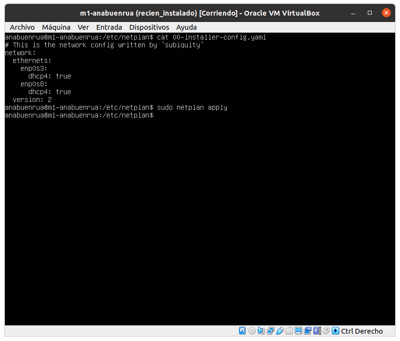

# Práctica 1

> Por: Mapachana

## Instalación de las máquinas virtuales

Comenzamos descargando la iso de Ubuntu Server 20.04.4 LTS.

Ahora, abrimos VirtualBox y creamos una nueva máquina virtual pulsando en Nueva.

Ahora, procedemos a crear la primera máquina virtual con 1GB de RAM y 10GB de disco duro dinámico.

Añadimos un disco duro dinámico: 

Ahora añadimos la iso pulsando con clic derecho en configuración y a añadir unidad óptica:

La máquina virtual ya está lista para el arranque.

Procedemos a lanzarla y configuramos la instalación:

Primero seleccionamos el idioma: español.

A continuación pulsamos en detectar teclado y nos selecciona la variante española del mismo.

Dejamos la configuración por defecto en los siguientes pasos.

Introduzco mi nombre y mi usuario de la ugr con contraseña "Swap1234".

Una vez terminada la instalación le damos a reiniciar ahora y comprobamos que en efecto la máquina funciona.

Repetimos este mismo procedimiento con la otra máquina virtual.

## Configuración de la red

Para disponer de conexión a internet y poder conectar las máquinas entre sí y con el anfitrión vamos a añadir un adaptador de red en modo NAT y otro adaptador de red en solo-anfitrión.

Comenzamos con la red NAT

A continuación, como no tengo configurada la red solo-anfitrión en mi virtual box voy a crear una, en `archivo->Administrador de red anfitrión`:

Y ahora, en nuestra máquina virtual configuramos la red solo-anfitrión:

Arrancamos la máquina virtual para completar la configuración de la red editando el fichero `"/etc/netplan/00-installer-config.yaml"`:

Y, finalmente, ejecutamos el comando `sudo netplan apply` para hacer efectivos los cambios:

Comprobamos con el comando `ip address show` que la configuración se ha realizado correctamente:

## Instalando los programas necesarios

Primero vamos a instalar LAMP, para ello ejecutamos el comando `sudo apt-get install apache2 mysql-server mysql-client`.

Comprobamos la versión mediante el comando `apache2 -v` y comprobamos si está en ejecución con `sudo service apache2 status`:

Finalmente activamos la cuenta de root mediante el comando `sudo passwd root`:

Repetimos toda esta configuración e instalación en la otra máquina virtual a crear.

