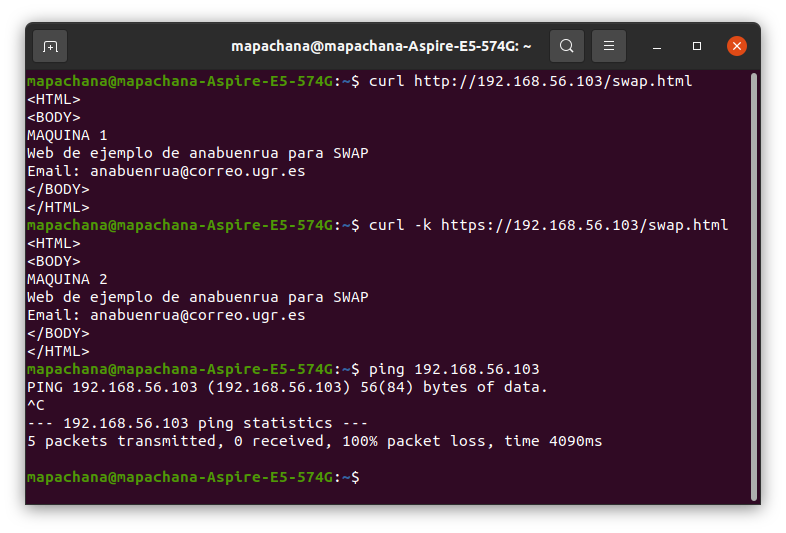

# Práctica 4

> Por Mapachana

## Certificado autofirmado SSL

Vamos a comenzar trabajando en m1.

Primero, vamos a activar el mmódulo ssl y relanzamos apache, para lo que ejecutamos:


A continuación creamos el directorio para los certificados que vamos a crear:


Ahora procedemos a crear los certificados con openssl.


Hemos usado varios argumentos para indicarle que genere una clave de 2048 bits y que tenga 365 días de validez, así como indicamos los ficheros para guardar la clave y el certificado.

Además, -x509 autofirma el certificado.

Introducimos los datos que nos pide por línea de comandos como nos piden:


### Opciones avanzadas

Como opciones avanzadas, se van a comentar distintos argumentos para generar los certificados con openssl req.

- -inform DER/PEM especifica el formato de entrada de los datos.
- -outform DER/PEM especifica el formato de salida de los datos.
- -subj /type0=value0/type1=value1/type2=... permite especificar los datos desde la orden. Las abreviaturas que sustituyen a type0, type1 están predefinidas y pueden consultarse en el manual.
- -text imprime el certificado en forma de texto.

## Apache con certificado SSL

Para configurar apache para que use el certificado SSL que acabamos de generar, vamos a empezar configurando en apache la ruta de los certificados.

Configuramos el archivo /etc/apache2/sites-available/default-ssl con la información de nuestros certificados:


Ahora activamos el sitio default-ssl, para lo que ejecutamos:


Para comprobar que hemos realizado todo correctamente, ahora accedemos a m1 desde el navegador, como en las otras prácticas vamos a acceder a la página swap.html usando https.

Nos dice que la conexión no es segura porque el certificado es autofirmado, pero le damos a continuar de todas formas.


Accdemos a la página, donde vemos en la parte de la url el candadito, aunque tiene una exclamación porque el certificado es autofirmado, como ya se ha dicho.


Si pulsamos sobre este candado y le damos a más información, nos muestra algo de información sobre el certificado.


Finalmente, vamos a copiar los certificados de m1 en m2, para lo que vamos a usar scp.

Para ello, primero creamos el directorio para almacenar los certificados y luego los copiamos con scp, ejecutando los siguientes comandos desde m1.


Ahora movemos los ficheros al mismo directorio que en m1 y repetimos el proceso para activar el módulo ssl, configuramos el archivo /etc/apache2/sites-available/default-ssl, activarlo y reiniciamos apache, de forma análoga a como lo hemos hecho en m1.

Comprobamos que funciona igual que con m1:


### Opciones avanzadas

Podemos obtener el certificado mediante openssl, para ello, desde mi ordenador anfitrión ejecutamos:


Y comprobamos que nos muestra el certificado.

Además, se pueden añadir otras opciones de apache con `SSLOptions +opcion`.

También se puede activar la redirección para que toda conexión http la redirija a ser https:

```
<VirtualHost *:80>
        // Cosas

        Redirect "/" "https://your_domain_or_IP/"

        //Más cosas
</VirtualHost>
```

https://www.digitalocean.com/community/tutorials/how-to-create-a-self-signed-ssl-certificate-for-apache-in-ubuntu-18-04-es

## Nginx como balanceador para peticiones HTTPS

Para configurar nginx con los certificados ssl, comenzamos copiando los ficheros de m1 a m3 mediante scp.


Creamos una carpeta ssl y movemos ahí lso certificados copiados.

Ahora editamos el fichero de configuración de nginx /etc/nginx/conf.d/default.conf añadiendo un servidor nuevo como se muestra:


Relanzamos nginx con sudo systemctl restart nginx y comprobamos que podemos acceder al balanceador por https:


### Opciones avanzadas

Como configuraciones adicionales para nginx se pueden usar varias directivas dentro del archivo de configuración /etc/nginx/conf.d/default.conf:

- ssl_protocols <lista de protocolos>. Su función es indicar que las conexiones por SSL y TLS que se van a establecer deben ser compatibles con las de la lista de protocolos indicada. Por ejemplo, SSLv2, TLSv1 o TLSv2.
- ssl_ciphers <lista de protocolos>. Su función es, de análogamente a ssl_protocols, limitar las conexiones a aquellas compatibles con los sistemas cifrados listados.

## IPTABLES

Comprobamos que el cortafuegos iptables está ya instalado en todas las máquinas con iptables --version.

Vamos a comenzar creando un script para aceptar todo el tráfico, ya que es la restricción más amplia al no tener ninguna y aceptar cualquier petición.

Después, iremos añadiendo otras reglas más específicas para restringir el tráfico, recordando siempre que la última regla introducida tiene prioridad sobre las anteriores.

Creamos un directorio en cada máquina /home/anabuenrua/scripts_iptable para almacenar todos los scripts.

En primer lugar realizamos el script para permitir todo el tráfico, para ello creamos el script siguiente en m1:


Lo ejecutamos mediante sudo bash aceptar_todas.sh y comprobamos que podemos seguir accediendo normalmente a ella, como por ejemplo mediante ping:


Ahora, escribimos un script para denegar todo el tráfico:


Y comprobamos que ahora no podemos acceder mediante ping:


### Configuración básica

Vamos a realizar un script con la configuración básica del cortafuegos en todas las máquinas virtuales. Esta configuración va a consistir en denegar todo el tráfico por defecto y solo permitir el tráfico en SSH, HTTP y HTTPS. Al ser un servidor, hay que tener en cuenta que se debe permitir que reciba peticiones.

Dado que la máquina m1 tenía configurado como puerto para ssh el puerto 2022, por simplicidad se ha vuelto a dejar habilitado el puerto 22 para ssh, editando el fichero /etc/ssh/sshd_config y cambiando el puerto del 2022 al 22. Para hacer efectiva la configuración se ha relanzado ssh con sudo systemctl restart ssh.

El script de configuración básica se muestra a continuación:


Comprobamos que podemos acceder por http y https a m1, pero no mediante ping:


También comprobamos que podemos acceder a m3 de igual manera:




### Configuración avanzada

La configuración anterior se puede mejorar, por ejemplo permitiendo el acceso a m1 y m2 solo a través de m3, además vamos a activar el acceso a ssh, ping y DNS en la red interna.

Para ello, escribimos el script como se muestra:


Copiamos los scripts a la máquinas m2 con scp y comprobamos que la granja funciona correctamente, pues ya no deja acceder a m1 directamente, pero sí mediante m3:


Además, ya se puede hacer ping.


## Configurar cortafuegos al arranque

https://linuxconfig.org/how-to-make-iptables-rules-persistent-after-reboot-on-linux

Para hacer persistentes las reglas y que se mantengan tras reiniciar las máquinas vamos a instalar iptables-persistent.


Al instalar el paquete, seleccionamos que sí queremos guardar las reglas actuales en los ficheros correspondientes tanto en ip4 como ip6.


El paquete solo guarda las reglas al instalarse, para modificar qué reglas se van a aplicar al reiniciar el sistema, hay que guardarlas ejecutando
```
iptables-save > /etc/iptables/rules.v4
ip6tables-save > /etc/iptables/rules.v6
```

Probamos a ejecutarlos y comprobamos que hay que loggearse como root para hacerlo.


Para eliminar la configuración al inicio simplemente borramos los ficheros generados.

## Instalación de certificados con certbot

Vamos a realizar la configuración en m1 y m3, para apache y nginx respectivamente.

Comenzamos instalando en cada una de las máquinas virtuales certbot como se muestra.


En m1 comenzamos instalando el plugin para apache ejecutando:


Ahora, para instalar un certificado ejecutamos el siguiente comando y rellenamos los datos que se nos piden:


Como no tenemos un dominio, el comando anterior nos da error.


Por ello, para solo generar el certificado se ejecuta:


Este comando crea el archivo /etc/cron.d/certbot sigueinte:


Para realizar la configuración de nginx análogamente se instala el plugin y se ejecutan los sigueintes comandos:


Y ejecutamos


Que de nuevo nos arroja el mismo error de antes al no disponer de un dominio correcto.

Para generar el certificado ejecutamos:


