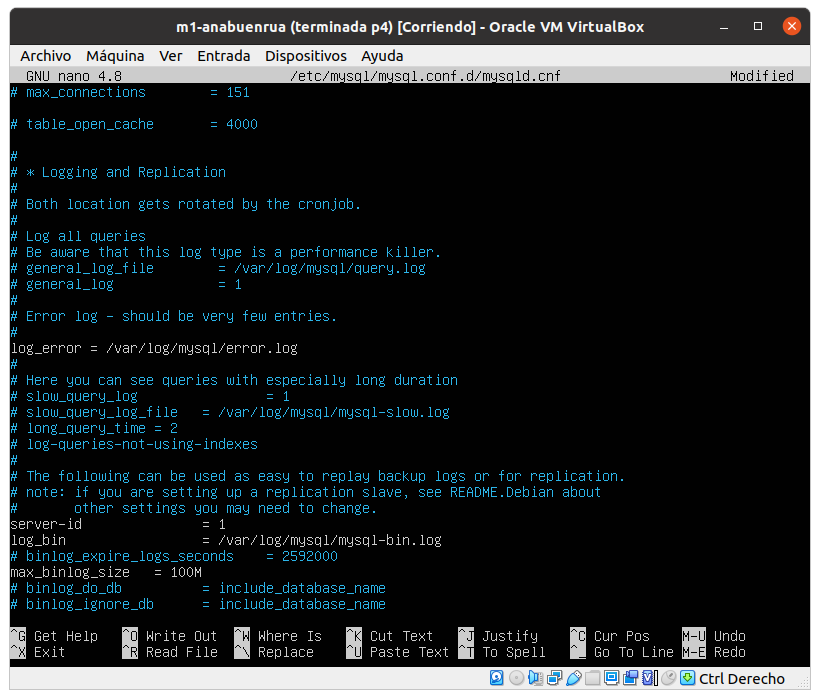

# Práctica 5

> Por Mapachana

## Base de datos MySQL

Antes de comenzar la práctica, vamos a desactivar las reglas de IPTABLES que creamos durante la práctica anterior, ya que tal y como lo configuramos antes el puerto de mysql está cerrado en todas las máquinas.

Para ello, vamos a ejecutar el script aceptar_todas.sh ubicado en /home/anabuenrua/scripts_iptable/aceptar_todas.sh con sudo bash aceptar_todas.sh en todas las máquinas.

Además, como hicimos persistentes las reglas, cada vez que reiniciemos alguna de las máquinas volveremos a desactivar las reglas.

Ahora sí podemos comenzar con la configuración de la práctica propiamente dicha.

Comenzamos comprobando la versión de mysql para comprobar que está instalado y para poder usarla más adelante.


Ahora vamos a conectarnos al servidor de mysql. No vamos a usar ninguna contraseña, así que cuando nos la pide le damos a enter.

A continuación creamos la base de datos 'estudiante' y le decimos que la use. Una vez en ella creamos la tabla 'datos', que va a contener campos para el nombre, apellidos, usuario y correo.

Finalmente añado mis datos a la tabla.


### Opciones avanzadas

Como opciones avanzadas, a la hora de crear las tablas podemos especificar que ciertos campos sean no nulos, sen únicos o que se usen como clave primaria (deben ser no nulos y únicos).

Para ello se usan las palabras clave NOT NULL, UNIQUE y PRIMARY KEY como se ve en:

```mysql
CREATE TABLE tasks (
    id INT AUTO_INCREMENT PRIMARY KEY,
    title VARCHAR(255) UNIQUE,
    start_date DATE NOT NULL,
    end_date DATE
);
```

https://www.mysqltutorial.org/mysql-not-null-constraint/
https://www.w3schools.com/sql/sql_unique.asp
https://www.w3schools.com/sql/sql_primarykey.ASP
https://www.mysqltutorial.org/mysql-unique-constraint/

Además, al insertar nuevas tuplas no hace falta indicar los campos de la tabla donde se va a insertar el valor mientras los valores se especifiquen en el mismo orden de definición de los campos.

Además, para consultar información sobre las tablas podemos usar SELECT para ver su contenido o DESCRIBE:


## mysqldump

A continuación vamos a replicar la base de datos estudiante de m1 en m2 usando mysqldump.

Comenzamos bloqueando las tablas para que sean de solo lectura, y así asegurarnos de que no se modifican mientras se realiza la copia.


Copiamos la base de datos en un archivo /tmp/estudiante.sql con mysqldump y, una vez terminado, eliminamos el bloqueo a las tablas que habíamos puesto antes.


Ahora copiamos este fichero de m1 a m2 mediante scp.


Finalmente copiamos la base de datos en m2 primero creando la base de datos en sí y luego restaurando los datos de esta.


Ya podemos comprobar que la base de datos se ha copiado correctamente.

### Opciones avanzadas

http://pwet.fr/man/linux/commandes/mysqldump/

mysqldump tiene varias opciones para ahorrarnos trabajo y asegurarse de que no cometemos errores importantes como no bloquear las tablas mientras las copiamos, dejarnos bases de datos de interés sin copiar o similares.

De entre esas opciones destacan --all-databases, que sirve para copiar todas las bases de datos. Si solo queremos algunas, podemos usar --databases <db1> <db2> .... 

Otra opción interesante es --add-drop-table, que añade un drop table antes de la creación de cualquier tabla.

--lock-tables bloquea todas las tablas mientras se realiza la copia, evitando así que tengamos que bloquearlas a mano como hemos hecho nosotros.

Finalmente, para obtener información del proceso podemos usar -v, que activa el modo verboso.


## Configuración maestro-esclavo

Para aplicar una configuración maestro-esclavo lo primero es editar el fichero /etc/mysql/mysql.conf.d/mysqld.cnf en m1 como se muestra, comentando la línea de bind-address, especificando los ficheros de log de error y de bin y poniendo el id a 1.




Reiniciamos el servicio con sudo systemctl restart mysql y comprobamos que ha ido bien con sudo systemctl status mysql.

Ahora en m2 editamos el fichero /etc/mysql/mysql.conf.d/mysqld.cnf igual que en m1, pero poniendo su server-id a 2, y de nuevo reiniciamos el servicio como antes.

Volviendo a m1, vamos a crear un usuario esclavo. Para crear el usuario correctamente, nos fijamos en la versión de mysql que se comprobó al principio, siendo esta la 8.0.28.

Por tanto, en sql ejecutamos:


(Usamos el with native porque de lo contrario sale un error de que se requiere autenticación certificada, que se soluciona así https://stdworkflow.com/927/2061-authentication-plugin-caching-sha2-password-reported-error-authentication-require-secure-connection)


donde vemos que hemos tenido un error, ya que en nuestra versión de sql no se puede especificar IDENTIFIED BY con GRANT, por lo que lo omitimos.

Y mostramos el estado del maestro.


Ahora en m2 configuramos los datos del maestro:


Finalmente quitamos el bloqueo del maestro (m1).


Y mostramos el estado:


Y comprobamos que todo funciona correctamente, pues si insertamos un usuario en m1 se muestra en m2.


## Mostrar estado de los servidores

Hemos mostrado el estado de los servidores antes, en la foto 4 y en la 8a.

Al comprobar que hay un 0 en seconds behind master quiere decir que la base de datos de la máquina esclava lleva 0 segundos de retraso en procesar los binary-log que se han especificado.

Que sea 0 suele significar que el esclavo está al día con el master, mientras que si tine un valor mayor es que aún está procesando.

https://dev.mysql.com/doc/refman/5.7/en/replication-administration-status.html

## Configuración maestro-maestro


## Configuración IPTABLES

