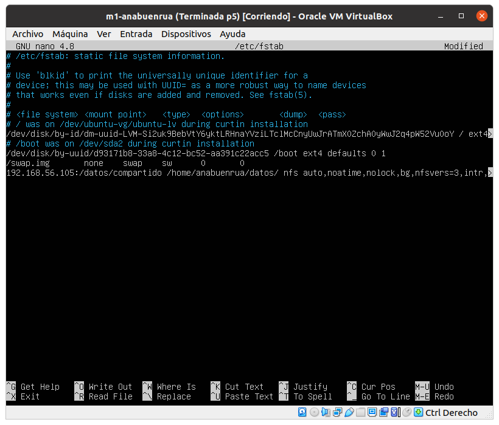

# Práctica 6

> Por: Mapachana

## Instalación de la máquina virtual

Para realizar la práctica creamos la máquina virtual NFS-anabuenrua, que tendrá, al igual que las otras, 1GB de RAM y 10GB de disco duro dinámico. Introducimos los datos:

Ahora asignamos una IP estática a nfs-anabuenrua, se ha escogido 192.168.56.105 editando /etc/netplan/00-installer-config.yaml.

Hacemos los cambios efectivos ejecutando sudo netplan apply y comprobamos que hay conexión.

## Configurar servidor disco NFS

Comenzamos la práctica trabajando en nfs-anabuenrua. Primero instalamos las herramientas básicas que vamos a necesitar

Ahora creamos la carpeta /datos/compartido donde vamos a tener los ficheros que se van a compartir entre las máquinas virtuales, cambiamos su propietario y grupo y asignamos permisos.

A continuación editamos /etc/exports para dar permiso de acceso a m1 y m2.

Finalmente relanzamos el servicio y comprobamos su estado

Ahora vamos a configurar m1 y m2. Para no ser repetitivo, se va a realizar y mostrar la configuración solamente en m1, ya que en m2 se haría la misma.

Comenzamos instalando las herramientas que vamos a usar

A continuación creamos el punto de montaje datos en /home/anabuenrua, le asignamos los permisos y montamos la carpeta remota.

192.168.56.105:/datos/compartido /home/anabuenrua/datos/ nfsauto,noatime,nolock,bg,nfsvers=3,intr,tcp,actimeo=1800 0 0

Finalmente comprobamos que funciona, pues al crear un archivo en la carpeta datos en m1 se muestra en m2 y en nfs:

### Opciones avanzadas

Para comenzar, vamos a hacer que el montaje de la carpeta remota se realice de forma automática al arrancar la máquina virtual. Para ello, vamos a editar el fichero /etc/fstab añadiendo la línea

como se muestra.

Además, en la máquina nfs-anabuenrua podemos comprobar qué puertos se están usando como se ve

## Seguridad en NFS

Comenzamos creando en nfs-anabuenrua en /home/anabuenrua una carpeta scripts_iptable para almacenar los ficheros de configuración de iptables como en las otras máquinas.

Vamos a crear un fichero en esta carpeta que contenga las reglas de seguridad por defecto de esta máquina.

### Opciones avanzadas

Como mountd y nlockmgr usan puertos dinámicos para poder escribir reglas de iptables primero vamos a fijar los puertos de estos servicios.

Comenzamos fijando el puerto de mountd, para lo que editamos el fichero /etc/default/nfs-kernel-server editando la línea correspondiente para fijar el puerto 2000 (por ejemplo, podríamos asignar otro):

Para fijar el puerto de nlockmgr creamos el archivo swap-nfs-ports.conf en /etc/sysctl.d/ con el contenido siguiente para fijar los puertos de tcp y udp a 2001 y 2002 respectivamente:

Ahora reiniciamos el sistema especificando este archivo de configuración:

Y comprobamos finalmente los puertos una vez realizada esta configuración

Ahora que hemos fijado los puertos de estos servicios, podemos definir reglas para abrir los puertos correspondientes a estos servicios. Partiendo del fichero de configuración ya presentado, lo editamos como se ve

Comprobamos de nuevo que funciona correctamente generando un fichero de nuevo como antes:

Tras comprobar que la granja web funciona correctamente y está protegida, instalo en nfs-anabuenrua iptables-persistent como hicimos en la práctica 4 para hacer las reglas persistentes al inicio.

