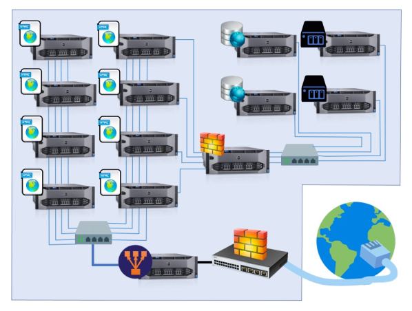
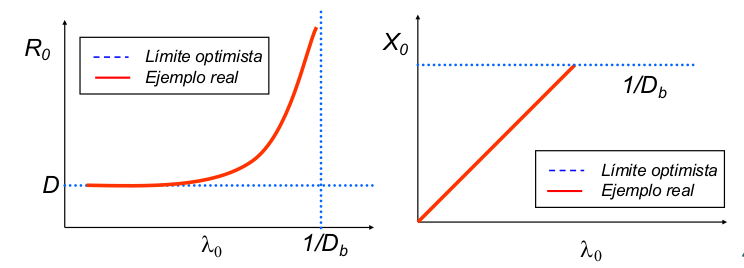

# Apuntes de SWAP

> Por: Mapachana

## Tema 1: Introducción.

### Brainstorming: ¿Qué problemas podemos encontrar?

- Que los usuarios se conecten.
- Disponibilidad.
- Mantenimiento del hardware.
- Seguridad.
- Sistema tolerante a fallos.

### 1.Introducción

Supongamos que nos encargan el despliegue de un servidor web de una empresa... hay que comparar el trabajo inicial de configuración vs el trabajo de mantenimiento.

#### 1.1 Historia
En los años 90:

- Los servidores Intel/AMD son baratos.
- Cada servidor tiene un sistema operativo diferente.
- **Un** sistema operativo y **una** aplicación en cada servidor.
- 2 servidores pasan a ser 6, quizás 50 o más servidores.
- El **espacio**, la **refrigeración** (aire acondicionado, por ejemplo) y la **alimentación** se convierten en un problema.

En los años 2000 en adelante:

- Los fabricantes "al rescate".
- Se centran en crear servidores más pequeños.
- Reducen el tamaño de los chassis (6-20 servers por rack).
- Crean los servidores "Blade" (30-60 servidores por rack).
- Problema de espacio solucionado más o menos.
- La **alimentación** y la **refrigeración** siguen siendo un problema (consumo eléctrico para la alimentación y refrigeración).

#### 1.2 Centros de Procesamiento de Datos (CPD)

Un Centro de Procesamiento de Datos (CPD) es una ubicación donde se concentran los recursos necesarios para el procesamiento de la información de una organización.

- Normativas TIA 942, ISO 27001, EN 1047-2, ISO14644, ASHRAE,
Uptime Institute, 24 7.
- Características:
  - **Armarios**.
  - **Infraestructura interior**.
  - **Sistema de alimentación**.
  - **Ventilación**.
  - **Cableado**: Se usa un falso suelo para poner el cableado.
  - **Refrigeración**: Se usa el falso suelo y los armarios unos frente a otros para crear corrientes de aire para ventilar. Desde el suelo se manda aire frío y los ventiladores de los pcs están mirando al mismo pasillo. Así se forman pasillos fríos y pasillos calientes.
  - Los **datos** están aparte en como una caja cerrada hermética, donde se mete un gas y así en caso de incendio no se pierden los datos.

El consumo (Green IT):

- Prácticamente el consumo de un CPD proviene del consumo del equipamiento del CPD y la climatización.
  - 38-63% corresponde a los sistemas (servidores y equipos.
  - 23-54% corresponde a la refrigeración.
  - 6-13% a los sistemas complementarios (sistemas electrógenos, sistemas de alimentación ininterrumpida).
  - 1-2% iluminación.

_Tecnologías verdes son aquellas que contribuyen a la reducción en el consumo de energía o emisión de dióxido de carbono._

- Consumo (Green IT): Reducir consumo equipamiento.
  - Optimización del consumo energético generado por los propios servidores y sistemas instalados.
    - Técnicas de virtualización:
      - Virtualización.
      - Consolidación de servidores.
    - Técnicas de utilización dinámica de recursos:
      - Herramientas de red.
      - Tecnologías GRID.
      - El modelo cloud (cloud computing).
        - Modelo de servicios (SaaS, PaaS, IaaS).
#### 1.3 Virtualización

Consumo (Green IT). Sirve para reducir el consumo del equipamiento.

Creación a través de software de una evrsión virtual de algún recurso tecnológico (plataforma de hardware, un sistema operativo, un dispositivo de almacenamiento, etc).

Por ejemplo te cobran 10€ por usar el servidor 1 hora, si necesitas dos servidores son 20€ (cloud computing) (Esto lo he apuntado rapidillo igual está mal).

Tipos:

- **Virtualización de plataformas**: Consiste en preparar un sistema operativo de los recursos de la plataforma subyacente.
  - Virtualización nativa o completa.
  - Para-virtualización.
  - Virtualización a nivel de sistema operativo.
  - Virtualización de aplicaciones.
- **Virtualización de recursos**: Consiste en la virtualización de recursos específicos del sistema, como la memoria virtual, el almacenamiento virrtual.
  - Memoria virtual.
  - Almacenamiento NAS.
  - Almacenamiento SAN.

Algunos software de virtualización son VMWare, VirtualBox, Parallels, etc.

##### 1.3.1 Consolidación de servidores

La consolidación de servidores es la reestructuración de la infraestructura del CPD con el fin de reducir costes y mejorar el control mediante la optimización de lso requisitos de recursos.

Varias máquinas se comportan como una, como azure.

#### 1.4 Técnicas de utilización dinámica de recursos: El modelo Cloud (Cloud computing)

- Modelo de prestación de servicios de negocio y tecnología, que permite al usuario acceder a un catálogo de servicios estandarizado y responder a las necesidades del negocio, de forma flexible y adaptativa, pagando únicamente por el consumo efectuado.
- Modelo que proporciona de manera conveniente acceso por demanda a un conjunto compartido y configurable de recursos informáticos (redes, servidores, almacenamiento, aplicaciones, etc) que pueden ser rápidamente dispuestos con un esfuerzo mínimo por parte del proveedor de estos recursos.

##### 1.4.1 Ventajas
- **Reducción de costes**:
  - Infraestructura.
  - Licencias de software.
  - Energía.
  - Personal.
- **Gestión**:
  - Menos incidentes.
  - Actualizaciones de software.
  - Automatización en gestión.
- **Prestaciones**:
  - Adaptación elástica.
  - Capacidad de almacenamiento ilimitada.
  - Disponibilidad.

##### 1.4.2 Desventajas
- **Conexión constante**.
- Puede ser **lento**.
- **Privacidad**.

---

La utilización dinámica de recursos consiste en acceso por demanda a un conjunto compartido y configurable de recursos informáticos. Es el modelo de negocio cloud.

- **SaaS**
  - Software as a Service.
  - Pagas por usar un software.
- **PaaS**
  - Platform as a Service.
  - Pagas por usar un entorno de desarrollo.
- **IaaS**
  - Infraestructure as a Service.
  - Pagas por usar una infraestructura.

#### 1.5 Arquitectura de servicio

- Sistema aislado. (Cuarta imagen)
- Arquitectura cliente servidor. (Primera imagen)
- Arquitectura de n capas. (Segunda imagen)
- Arquitectura cliente-cola-cliente. (Tercera imagen)

Nota: Nos referimos a las imágenes de izquierda a derecha.

Posibles aproximaciones para servidor web:

- Montar un servidor en una máquina.
- Adquirir un segundo servidor para desarrollo.
- Adquirir un segundo servidor para sustituir al principal en caso de desastre.
- Montar una granja web.

### 2. Conceptos básicos

Una **granja web** es un conjunto de servidores dedicados a servir contenido web a los usuarios finales.

Algunos de esos servidores servirán contenido estático, otros actuarán como servidores de bases de datos, otros para aplicaciones dinámicas, etc.

En cada uno de esos grupos de máquinas se puede instalar diferente tipo de aplicaciones y/o versiones:

- apache.
- nginx.
- thttpd.
- Cherokee.
- node.js

Cada uno de esos es más eficiente para un tipo de servicios.

Son sistemas muy complejos pero sumamente flexibles y funcionales.

En muchos casos, una granja web albergará muchos sitios web:

- correspondientes a varias empresas.
- servicios bien diferenciados de una empresa.

Estos sistemas resuelven los problemas de sistemas más simples para dar servicio a un alto número de usuarios.

Al usar varias máquinas va a ser escalable. Los muros representan firewalls, luego algo para distribuir la carga (tridente), servidores web de configuracuón de web (con bolas del mundo) y servidores de datos.

### 3. Un sitio web mal planificado

#### 3.1 Introducción

Cuando nos encargan el desarrollo de un sitio web, inicialmente se suelen instalar todos los servicios en una sola máquina.

Es la opción más rápida y barata.

Si no hay muchos usuario (poco tráfico), funcionará.

Solo hace falta una máquina con el sistema operativo bien configurado, una aplicación de servidor web, y una conexión a internet.

Ese sitio, con esa configuración tan simple, no tardará en experimentar problemas conforme se icnremente el tráfico de red (peticiones).

Un problema puede sobrevenir por el uso de un almacenamiento de datos inadecuado (no usar bases de datos bien configuradas), que redunda en una falta de escalabilidad.

Primera aproximación:

- Montar un servidor en una máquina.
  - Ventaja: Fácil y rápido.
  - Desventaja: Necesitará más trabajo de mantenimiento tarde o temprano, tendremos problemas.

Las tareas derivadas de problemas hardware y sofwtare, para dar el servicio adecuado, acaba siendo un trabajo demasiado costoso en un sistema mal planificado.

Surge la necesidad de controlar posibles problemas:

- Con la arquitectura del sistema.
- Con la disponibilidad.
- Con la carga del sistema.

#### 3.2 Problemas de la arquitectura del sistema

En muchos sitios, una máquina servidora ofrece todos los servicios, conectada directamente a internet.

Comúnmente se pone en marcha sin cortafuegos adecuado.

Algunos servicios son para uso de los empleados, por lo que sobrecargan al servidor (que no dará buen servicio a los usuarios externos).

Riesgo de seguridad.

Modificaciones directamente en el servidor de producción.

#### 3.3 Problemas con la disponibilidad

Conforme los usuarios usan un sistema, los errores derivados de la programación van apareciendo.

Además, suelen solicitar mejoras o ampliaciones del sistema.

Arreglar esos errores puede resultar complicado: los retoques del código o quitar servicios pueden suponer nuevos errores más adelante.

Las actualizaciones del SO, de aplicaciones o servicios pueden afectar al rendimiento global.

Los cambios van directamente al servidor de producción.

Una posible solución es comprar una segunda máquina para desarrollo.

- Adquirir una segunda máquina para desarrollo:
  - Ventajas:
    - Las mejoras en software se pueden probar en la máquina de desarrollo antes de pasarlas al servidor de producción.
  - Desventajas:
    - Trabajo extra.
    - Coste de adquisición.
    - No se resuelven los problemas derivados de un alto tráfico.

Tarde o temprano el hardware falla. Una posible solución es tener una máquina servidor replicada, lo que se llama **cold spare server**.

- Cold spare server:
  - Desventajas:
    - Hay que tenerla actualizada (programas y datos).
    - Requiere esfuerzo y coste de adquisición.

Otra posible solución es adquirir un servidor para sustituir el principal en caso de desastre.

- Adquirir otro servidor para sustituir al principal:
  - Ventajas.
    - En caso de desastre grave, se puede sustituir el servidor principal por el secundario y continuar trabajando.
  - Desventajas.
    - No se resuelven los problemas derivados de alto tráfico.

Otra vez, ni siquiera actualizando el hardware del servidor de producción se podrá hacer frente a ciertos niveles de tráfico o carga.

#### 3.4 Problemas con la carga del sistema

Un sitio con poco tráfico funcionará con una sola máquina.

Ante un incremento del número de accesos, el hardware y software comenzarán a fallar.

Los recursos se verán sobreutilizados (uso de CPU por encima del 90%, uso de almacenamiento y de toda la memoria).

Los elementos hardware que primero suelen fallar son las fuentes de alimentación y los discos duros.

Una posible solución es configurar varias máquinas, dedicando una a cada aservicio que se esté ofreciendo.

- Configurar varias máquinas, una por servicio:
  - Ventajas:
    - Un fallo en una solo afecta a ese servicio.
  - Desventajas:
    - Aún así, el sitio no es escalable (no podrá dar soporte a un número creciente de usuarios para cierto servicio).

Aclaración: Si solo hay una máquina por servicio no es escalable.

##### 3.4.1 Escalabilidad

La escalabilidad es la capacidad para dar soporte a un número creciente de usuarios.

Tanto el hardware y software de los servidores, pero sobre todo la estructura, organización y configuración de la red deben estar preparados para añadir recursos según sean necesarios.

- Tipos de escalabilidad:
  - **Escalabilidad vertical**: Mejorar el hardware metiedno más RAM u otros componentes similares a una máquina.
  - **Escalabilidad horizontal**: Meter más máquinas al mismo servicio.

#### 3.5 Solución final

Cuando los cambios de vuelven inmanejables, solo queda reestructurar todo el sistema.

No merece la pena parchear el sistema a varios niveles.

Supone una inversión continua en tiempo y dinero.

Importante analizar las necesidades y hacer unas buenas especificaciones -> capacity planning, modelos analíticos.

### 4. Un sitio web de éxito.

Según lo comentado, la estructura general para montar una granja web que escale correctamente sería:

Complejidad mayor que los sistemas basados en máquinas simples.

- Montar una granja web:
  - Ventajas:
    - Escalable
    - Con alta disponibilidad
  - Desventajas:
    - Complejidad en la instalación y configuración

En aquellos casos en que haya que hacer frente a un alto tráfico de red y dar servicio a millones de usuarios, es la mejor solución.

En la planificación deberemos tener en cuenta:

- Siempre habrá puntos débiles.
- Siempre habrá gente que ataque los puntos débiles.
- El tipo de red es fundamental (ancho de banda).
- La seguridad es muy importante.

## Tema 2: Alta disponibilidad y escalabilidad

### Brainstorming

- ¿Cuánto tiempo está disponible un sistema para dar respuesta a usuarios?
- ¿El sistema se adapta bien a más peticiones?

### 1. Introducción

- Usuarios (disponibilidad)
  - Sitio web operativo **siempre** que se conecte.
  - Tiempo de respuesta sea **rápido**.
- Administradores (escalabilidad)
  - Sitio web que se adapte a **más peticiones**.
  - Tiempo de respuesta sea **rápido**.

### 2. Concepto de alta disponibilidad

- Es un protocolo de **diseño del sistema** y su implementación asociada que asegura un cierto **grado absoluto de continuidad operacional** durante un **período de medición** dado.

- Capacidad de aceptar visitas las 24h todos los días.

Cuando un sitio no está disponible se dice que se ha caído o sufre un problema de no-disponibilidad.

- Tipos:
  - Tiempo de no-disponibilidad (downtime) programado: Este tiempo está planeado, por ejemplo para actualizaciones del SO, aplicaciones o hardware.
  - Tiempo de no-disponibilidad (downtime) no programado: Es impredecible. Para reducirlo una posible solución sería la redundancia.

Solo debería haber tiempos de no-disponibilidad programados, y que estos sean lo más cortos posibles.

#### 2.1 Medir la disponibilidad

Medir la disponibilidad dando un porcentaje.

- Escala "punto nueve":
   100-(tiempoCaido / periodoTiempo) *100
   Availability = Uptime / (Uptime + Downtime)

Nota: Ambas ecuaciones son equivalentes

Por ejemplo:
  caída de 1 hora en 1 día -> 95.83333% de disponibilidad.
  caída de 1 hora en 1 semana -> 99.404% de disponibilidad.

Otro ejemplo:
  Horas en un año (período) = 8760
  Horas caído (tiempo caído) = 1830
  Tiempo en activo = 8760-1830 = 6930
  Disponibilidad = 6930/8760 = 0.791 -> 79.1%

Lo ideal es tener un 100% de disponibilidad, esto significa no sufrir caídas no programadas.

Los sitios web se conforman con alcanzar un 99.9% o 99.99% (medido en un año, porque si lo mides en 3 minutos y no se cae tienes un 100% de disponibilidad, pero tu medida no sirve de nada).

##### 2.1.1 Disponibilidad con más de un servidor

¿Cómo podemos calcular la disponibilidad de un sistema?

Para un sistema s con n componentes su disponibilidad se calcula como:

As = Ac1 * Ac2 * $\cdot$ * Acn

Si tenemos dos servidores (web + BD) y cada uno tiene 99% la disponibilidad del sistema será 99*99=98.01%

Siempre suponemos el peor caso, es decir, que esté caído el servidor web y justo después se caiga el de BD, luego si cada uno puede estar caído 3.65 días al año, podemos esperar que el sistema esté caído un total de 7.3 días en un año.

Pero los sistemas reales son más complejos, hay muchos más elementos y algunos redundantes. Necesitamos fórmulas más complejas.

Por ejemplo:

Suponemos que si cualquier componente falla todo el sistema falla.

La disponibilidad será:

85 * 90 * 99.9 * 98 * 85 * 99 * 99.99 * 95 = 59.87%

Al usuario le importa que el sistema proporcione el servicio. Si está caído, le dará igual que sea por el cortafuegos o por fallo de una aplicación web.

##### 2.1.2

Si el sistema tiene un componente replicado, la disponibilidad de esa parte del sistema completo será:

A_NuevoC = Ac1 + ((1-Ac1) * Ac2)

Por ejemplo, en el ejemplo anterior que el servidor web tenía disponibilidad de 85%, si lo replicamos tendríamos:

disponibilidad_web2 = 0.85 + (1-0.85) * 0.85 = 0.9775
disponibilidad_web2 = 85 + (100-85) * 85 = 97.75

Antes teníamos un 59.87% para todo el sistema. ¿Qué disponibilidad tendremos si replicamos el servidor web y el cortafuegos?

Cada uno de esos componentes (servidor web y cortafuegos) tendrán ahora 97.75%.

Y el sistema:

97.75 * 90 * 99.9 * 98 * 97.75 * 99 * 99.99 * 95 = 79.10%

Se ha mejorado en 19.23%.

Pasaríamos de unas 3500 horas de no-disponibilidad al año a unas 1830 horas de no-disponibilidad al año.

Si replicáramos cada elemento de red, servidores e ISP, dejando un solo centro de datos:

97.75 * 99 * 99.9999 * 99.96 * 97.75 * 99.99 * 99.99 * 99.75 = 94.3%

Mejorado en 34.43%.

Pasaríamos de unas 3500 horas de no-disponibilidad al año a unas 500 horas de no-disponibilidad al año.

Si generalizamos la última ecuación para cuando replicamos dos componentes:

$A_{nuevo} = AC_{n-1} + ( (1- AC_{n-1}) * AC_n)$

Así, si hemos añadido un tercer servidor web:

disponibilidad_web3 = 97.75 + (100 - 97.75) * 85 = 99.6625

Y si añadimos un cuarto servidor web:

disponibilidad_web4 = 99.6625 + (100-99.6625) * 85 = 99.949

##### 2.1.3

**Ejercicio**

Calcular la disponibilidad del sistema si tenemos dos réplicas de cada elemento (en total 3 elementos en cada subsistema).

#### 2.2 Cómo mejorar la disponibilidad

El uso de **subsistemas redundantes** y monitorizarlos mejora la disponibilidad del sistema global.

Surgen conceptos derivados:

- Disponibilidad de red.
- Disponibilidad de servidor.
- Disponibilidad de aplicación.

Si la disponibilidad de red es baja, quizás haya que mejorar el ancho de banda, y no tenga sentido centrar esfuerzos en mejorar las aplicaciones.

##### 2.2.1 Disponibilidad de la red

El diseño debe tener **redundancia** a todos los niveles:

- Conexión a internet.
- Routers/cortafuegos/balanceadores.
- Servidores.

Si hay que recortar costes, algún elemento puede ser único: por ejemplo el rputer, si el proveedor se compromete a reemplazarlo en pocas horas.

##### 2.2.2 Disponibilidad del servidor

Casi cualquier elemento hardware del servidor puede fallar: CPU, memoria, discos, placas, etc.

Existen productos en el mercado con cualquier **elemento duplicado**.

Por ejemplo sistemas redundantes en el Curiosity (con doble placa).

Puesto que casi cualquier elemento hardware del servidor puede fallar se pueden configurar los servidores con **redundancia mediante software**. Esto supone una mejora de la escalabilidad.

**Monitorizar** la disponibilidad con las herramientas del SO.

El desarrollador Emerson ofrece herramientas para monitorizar hardware y software.

##### 2.2.3 Disponibilidad de las aplicaciones

Es complicado medir las prestaciones de las aplicaciones.

El funcionamiento de unos módulos afectan al de otras aplicaciones (dependencias).

El desarrollador del SO suele facilitar herramientas para monitorizar también las aplicaciones en ejecución.

Dependencia entre aplicaciones o módulos de aplicación:

Si un módulo falla, el proceso no se completa, y la experiencia de usuario es mala.

Desarrollar aplicaciones robustas -> hacerlas redundantes.

Si una parte del proceso falla, que haya una alternativa para completarlo.

### 3. Concepto de escalabilidad

Cuando una persona sufre estrés, su capacidad para afrontar tareas se ve mermada.

Cuando un sistema experimenta estrés. su capacidad para dar servicio también se ve afectada.

Entendemos por estrés una alta demanda de recursos.

Incremento del nivel de estrés:

- Cambios en las aplicaciones.
- Fallos o caídas de algunas partes del sistema.
- Incremento del número de máquinas (si está mal configurado).
- Incremento repentino del número de usuarios del sitio.
- Etc.

**Definiciones de escalabilidad**:
- Capacidad de un sistema de manejar la carga, y el esfuerzo para adaptarse al nuevo nivel de carga.
- Capacidad de adaptación y respuesta de un sistema con respecto al rendimiento del mismo a medida que aumentan de forma significativa el número de usuarios del mismo.

Cuanto más abajo de la pirámide más impacta un aspecto en la escalabilidad, luego lo más relevante es el diseño.

Si un sitio gana popularidad, o si llega una fecha señalada, puede incrementarse su carga.

Para manejar esa carga, las empresas tienen más servidores de los necesarios normalmente.

Decidir cómo **añadir más recursos al sistema** web es crucial en el diseño inicial y en el mantenimiento.

En ocasiones, si la CPU del servidor está al 95% todo el tiempo, cambiándola puede ser suficiente para cierto nivel de carga. Pero si más adelante hay más carga, será insuficiente.

Dos tipos de escalado:

- Ampliación **vertical**: Incrementar la RAM, CPU, disco de un servidor.
- Amplicación **horizontal**: Añadir máquinas a algún subsistema (servidores web, servidores de datos, etc).

En ocasiones una ampliación vertical puede ser suficiente.

¿Cómo analizar la sobrecarga?

- Si la **CPU** está cerca del 100% todo el rato y el resto de subsistemas no está sobrecargado, sustituir por una CPU más potente.
- Si el uso de **RAM** es muy alto, veremos un uso alto de disco (por swapping). Incrementando la cantidad de RAM mejoraremos el rendimiento.
- Un **ancho de banda** insuficiente afectará al rendimiento. Contratando una mejor conexión será suficiente.

---

**Transformar el servidor web en una granja web**

- Proceso complejo.
- **Preparar aplicaciones** para distribuir la carga.
- Configurar la red para soportar el tráfico creciente.
- Configuración del **balanceo de carga** para formar un cluster web para cada servicio.

Una granja web puede tener varios clusters web.

### 4. Escalar un sitio web

Tenemos que configurar tres niveles:

- Máquinas como servidores web.
- Aplicaciones.
- Almacenamiento.

#### 4.1 Nivel de web

El **nivel de web** se puede configurar **balanceando la carga**: Uso de una máquina con software específico.

También se puede usar un **balanceador hardware**:

  - Local director (Cisco).
  - ServerIron (Foundry).
  - BigIP (F5).

El balanceador pasa peticiones a los servidores según el tráfico de la red.

Hay varios algoritmos para decidir qué máquina final servirá cada petición:

- Por turnos (round-robin): Se van mandando por orden. Si hay 3 máquinas m1, m2 y m3, se van mandando por orden como m1 m2 m3 m1 m2 m3 m1 m2 m3...
- Según el menor número de conexiones: Se manda una conexión nueva a la que tiene menos.
- Por ponderación: Si una máquina tiene el triple de RAM que la otra, de cada 4 peticiones, 3 se asignan a la máquina con el triple de RAm, y 1 a la que tiene menos RAM.
- Por prioridad: Se usa un esquema por prioridad.
- Según el tiempo de respuesta: Se hace un ping a todas las máquinas y la que tenga el menor tiempo de respuesta se le manda a esa.

Por si falla el balanceador de carga se pueden usar dos balanceadores de carga (redundancia).

#### 4.2 Nivel de aplicaciones

Escalar el **nivel de aplicaciones** requiere diseñar el software pensando en que se ejecute en varios servidores:

- Paralelismo.
- Transparencia de ubicación: no debe haber dependencia de una máquina concreta para ejecutarse la aplicación.

Es importante diseñar las aplicaciones desde el principio para que se ejecuten en varios servidores.

Adaptar posteriormente una aplicación dependiente de cierto servidor puede ser costoso.

#### 4.3 Nivel de almacenamiento

Escalar el **nivel de almacenamiento** es complejo y depende del tipo de servicios a ofrecer:

- LDAP: Protocolo Ligero de Acceso a Directorios.
- NFS: Sistema de archivos de red.
- Bases de datos.

Cada uno de estos mecanismos suele requerir mecanismos y configuraciones diferentes.

### 5. Conclusiones

- **Conceptos clave**: Escalabilidad y alta disponibilidad.
- **Monitorización** para detectar problemas y determinar posibles mejoras del sitio web.
- La escalabilidad se suele implementar **replicando servidores** para las mismas tareas.
- Conseguir disponibilidad y escalabilidad mediante **balanceo de carga**.

## Tema 3: La red de una granja web

### Brainstorming

- ¿Qué configuración de red es más adecuada para la granja web?
- ¿Será segura?

### 1. Introducción

La construcción de una **red segura y escalable** es fundamental para cualquier servidor.

Si la red no está bien estructurada, los servidores no pueden servir la información.

El administrador/diseñador del sistema debe analizar las opciones de conexión a Internet y diseñar la aestructura de red.

Debe separar las subredes corporativas y también conectar a redes privadas de proveedores.

Hay que decidir el ancho de banda necesario a contratar.

Todas estas decisiones de diseño implican un estudio del hardware y aplicaciones software disponibles:

- Switch, hub, router, balanceador, etc.
- Sistema operativo, monitorización, balanceo, etc.
- Carga del sistema.

La carga del sistema es D=S*V, donde S es tiempo de servicio (lo que tarda en usar cada elemento) y V la razón de visitas (veces que se utiliza un elemento). La D es la demanda.

El elemento que tenga mayor demanda es el que va a bloquear.

En los siguientes gráficos, la R es tiempo de respuesta y la X la productividad.

### 2. Configurar la red del sistema Web

La configuración de la red requiere:

- Elegir el modelo de red más adecuado.
- Elegir el hardware (estándar).
- Estructurar la red aislando subredes.
- Definir los puntos de entrada a las diferentes subredes.

Conceptos:

- Eje principal (backbone).
- Zona segura (DMZ).
- Front-rail / back-rail.
- Redes seguras externas.

### 3. EL eje principal de la red del sistema (Backbone)

**Backbone**: Eje principal de enlace entre máquinas.

Para que nos entendamos, es la línea principal que conecta varios servidores, ya sean servidores web, de base de datos, etc. Pero esta definición NO es formal.

Se puede formar con:

- Switch: Además de la funcionalidad del hub, hace que la información proveniente del ordenador de origen se envíe al de destino.
- Router: Además de la funcionalidad del switch, interconectan varias redes y tienen la capacidad de escoger la mejor ruta para que los paquetes de datos lleguen a su destino.
- Hub: Dispositivo sencillo; recibe datos procedentes de un ordenador para transmitirlo a todos los demás que estén conectados.

Gestiona las comunicaciones entre servidores y redes:

### 4. Configurar una zona segura (DMZ)

Zona desmilitarizada o **DMZ** (demilitarized zone). 

Área restringida o aislada y totalmente controlada.

Este control se suele realizar con un cortafuegos.

Quedan controlados los servicios y aplicaciones ofrecidos a otras redes externas al DMZ.

Los servicios de la granja web se ofrecen de forma estándar mediante dirección IP y puerto.

Los cortafuegos, routers y balanceadores de carga restringen el tráfico de entrada o salida.

La comunicación entre backbones se hace mediante un cortafuegos o configurando servidores con doble tarjeta de red.

La separación de las redes refuerza la seguridad del sistema.

En el siguiente gráfico, Web01 y Web02 tienen doble tarjeta de red y los Ap01 y Ap02 se pueden considerar zona segura, porque solo se accede a ellos desde un sitio controlado.

Existen varias alternativas para conectar la granja web a otras redes:

- Configuración sin DMZ.
- Configuración de DMZ simple.
- Configuración de DMZ tradicional.
- Configuración de DMZ doble.

Van de menos seguras a más seguras. La más segura es la DMZ doble.

#### 4.1 Configuración sin DMZ

Tanto los **servidores** de la granja web como otras máquinas están conectadas a la **misma subred**.

Se **comparten recursos** (incluso salida a Internet).

Solo tiene sentido en empresas muy pequeñas donde no hay problemas de prestaciones.

Problemas:

- Compartición del ancho de banda (servidores y máquinas de escritorio).
- Asegurar los servidores es más complicado.
- Si uno de los servidores se ve comprometido, el resto de recursos puede ser atacado.
- Las máquinas de escritorio suponen un problema de seguridad.

#### 4.2 Configuración de DMZ simple

Los **servidores** expuestos deben **aislarse** con un cortafuegos.

Servidores web en una red y servidores de bases de datos o disco en otra, protegida con un cortafuegos. Así se protegen los servidores de bases de datos o disco y las máquinas de escritorio.

Problemas:

- Los servidores web están conectados directamente a Internet.
- El cortafuegos puede ser un cuello de botella.
- Los servidores y máquinas tras el cortafuegos aún comparten ancho de banda.
- Las máquinas de escritorio aún están en la misma red que las BD.

#### 4.3 Configuración de DMZ tradicional

La idea es resolver los problemas de la configuración anterior:

- Evitar ancho de banda de la red corporativa compartido.
- Evitar inseguridad de los servidores expuestos.

Problemas:

- Dificultad para configurar correctamente el cortafuegos (controlar distintos tipos de redes).
- El cortafuegos es un posible cuello de botella.
- Si la configuración del cortafuegos tiene errores, entonces todo queda expuesto.

#### 4.4 Configuración de DMZ doble

- Configuración ideal para una granja web.
- Se basa en **aislar todos los servidores** con varios **cortafuegos**.

Es la **configuración más segura**:

- El DMZ tiene un **front-rail** y un **back-rail**.
- El delantero es un segmento de red conectado a internet.
- Los servidores quedan protegidos con el cortafuegos.
- El trasero está conectado a la subred interna (segura), y protegido con otro cortafuegos.

### 5. Conectar servidores al front-rail

Los servidores conectados al front-rail deben dar servicios a clientes a través de internet: HTTP, SMTP, POP3, FTP, etc.

Otros servicios no se ofrecen por el front-rail: Bases de datos, terminal.

Hay dos tipos de servidores:

- **Single-NIC**: Conectado solo a la subred frontal; aislado de la trasera.
- **Multi-NIC**: Conectado a la frontal y la trasera.

Un servidor multi-NIC puede acceder a la subred trasera para consumir un recurso.

Su configuración requiere de reglas específicas en la tabla de enrutamiento para encaminar el tráfico hacia la subred trasera.

Hay que ser cuidadosos al establecer las reglas para no dejar caminos que comprometan la seguridad.

### 6. Conectar servidores al back-rail

Los servidores conectados a la subred trasera son accesibles:

- desde subredes seguras y controladas.
- o bin desde servidores con multi-NIC.

La subred trasera no debe conectarse directamente a Internet.

Se pueden conectar servidores single-NIC para servir aplicaciones, BD o disco.

El cortafuegos protege los servidores. Sus reglas deben dejar acceso a ciertas aplicaciones y servicios según tipo de usuario.

### 7. Resumen de configuraciones

Resumen de las configuraciones de los servidores y a qué subred pueden acceder:

- **Doble conexión al front-rail y back-rail**:
  - Requiere doble tarjeta de red.
  - Adecuado para acceder a internet y servidores internos.
  - Configuración apra servidores HTTP, SMTP, POP3, FTP, etc.
  - Ofrecen servicios hacia Internet y a las subredes seguras.
- **Conexión solo al front-rail**:
  - Requiere solo una tarjeta de red.
  - Adecuado para acceder solo a Internet.
  - Los servicios ofrecidos quedan aislados.
  - Configuración para servidores HTTP, SMTP, POP3, FTP, etc.
  - Ofrecen servicios hacia Internet.
- **Conexión solo al back-rail**:
  - Requiere solo una tarjeta de red.
  - Para servidores que no necesitan acceso a Internet.
  - Servicios ofrecidos a las redes corporativas/seguras.
  - Configuración para servidores de BD o aplicaciones.

### 8. Conectar la granja web a Internet

La conexión a internet depende de varios factores para **asegurar la calidad del servicio y la seguridad**:

- Calidad del servicio y ancho de banda.
- Filtrado y bloqueo de paquetes.
- Network Address Translation (NAT).

#### 8.1 Calidad del servicio y ancho de banda

La **calidad del servicio** está directamente relacionada con el **ancho de banda** para salir a Internet.

**Ancho de banda**: Cantidad de información que puede fluir por una conexión de red en un período determinado. Se mide en bits por segundo (kpbs, Mbps, Gbps, Tbps).

Es adecuado definir qué porcentaje del ancho de banda se reserva para cada tipo de tráfico (HTTP, SSL, FTP,...). Los routers actuales permiten establecer esos parámetros.

Queda determinado por los métodos de señalización, las tarjetas de red y los demás equipos de red.

#### 8.2 Filtrado y bloqueo de paquetes

Conviene establecer filtros de forma que solo le llegue a una máquina el tráfico que debe llegarle.

Otros tipos de tráfico se bloquearán para que no le lleguen. Aunque los ignorase, los **paquetes sobrecargan la red**.

Los paquetes contienen información de IP origen, IP destino y puerto (servicio), por lo que esta información se usará para el filtrado.

Se pueden usar **cortafuegos**, routers o concentradores.

**Routers**: Un router de filtrado de paquete utiliza reglas para determinar la autorización o denegación del tráfico según:

- Dirección IP de origen.
- Dirección IP de destino.
- Tipo de mensaje ICMP.
- Puerto TCP/UDP de origen.
- Puerto TCP/UDP de destino.

"Una ACL es una lista secuencial de sentencias de permiso o denegación que se aplican a direcciones IP o protocolos de capa superior".

¿Cómo funcionan las ACL?

Las ACL no actúan sobre paquetes que se originan en el mismo router.

Las ACL se configuran para ser aplicadas al tráfico entrante o saliente.

Las sentencias de la ACl operan ne orden secuencial. Esto es importante para primero permitir y luego bloquear y no al revés.

Una sentencia implícita final cubre todos los paquetes para los cuales las condiciones no resultan verdaderas (implicit deny any statement/deny all traffic).

#### 8.3 Network Address Translation (NAT)

Con NAT mapeamos una dirección pública a una dirección privada de una de las máquinas servidoras internas.

Mejora la seguridad: Se ocultan las verdaderas IP de los servidores últimos (back-end). 

Esto lo pueden hacer los routers, cortafuegos y balanceadores de carga.

Incluso podemos poner varios niveles:

- El cortafuegos filtra los paquetes.
- El balanceador distribuye.

### 9. Conectar la granja web a redes seguras

Algunas organizaciones necesitan los servicios de otras empresas (por ejemplo bancos).

Para ello se conectan a redes seguras de esas empresas.

La conexión a redes aseguradas es similar a la conexión a Internet, pero con menos riesgos.

Hay que poner un **mecanismo de filtrado y bloqueo de paquetes** para evitar posibles ataques desde las máquinas de esas redes.

Hay que tener en cuenta las necesidades de los usuarios en relación a los servicios que queremos obtener de la empresa.

Podemos realizar la conexión mediante cortafuegos o mediante protocolos seguros (SSL).

**Por ejemplo**: Queremos usar los servicios de un banco para cobrar con tarjeta de crédito (operación de riesgo).

Se haría mediante conexión segura controlada por el banco.

El banco nos intala un router para conectarnos a su red.

Instalar una interfaz de red dedicada y conectada a ese router en los servidores que vayan a consumir ese tipo de servicio.

Por ejemplo configurar un servidor en el back-rail como pasarela para las operaciones con tarjeta de crédito.

### 10. Conclusiones

- La configuración de la red de la granja web se puede hacer de varias formas.
- La más segura es con el doble DMZ (subred frontal+ subred trasera).
- Los usuarios acceden desde Internet a los servidores conectados en la subred frontal.
- Las máquinas en la subred trasera dan servicios a los usuarios en la red corporativa y a los servidores de la subred frontal.
- En la calidad de servicio influye:
  - El ancho de banda de conexión a Internet.
  - El filtrado y bloqueo de paquetes.
  - El balanceo de la carga entre los servidores.
- Se pueden obtener servicios externos conectando a redes seguras (por ejemplo un banco).

