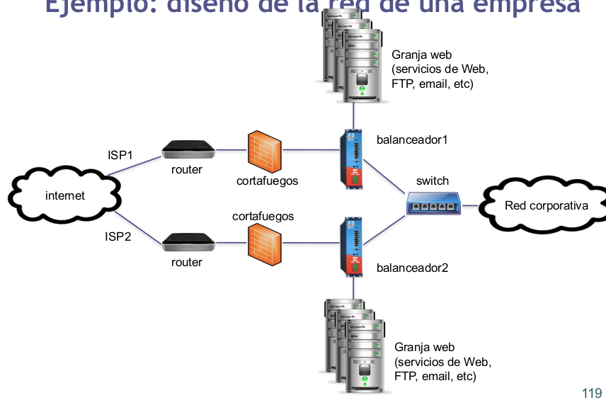
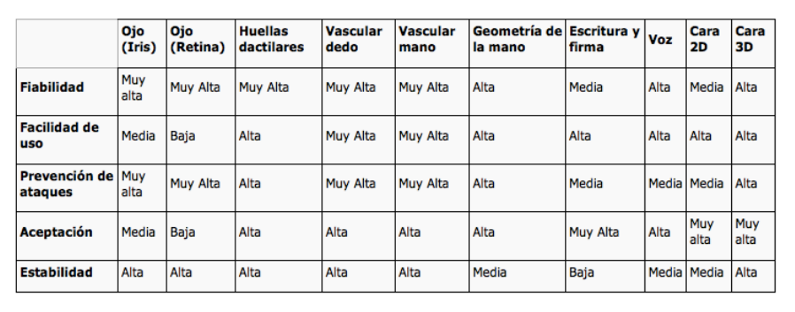

# Apuntes de SWAP

> Por: Mapachana

## Tema 1: Introducción.

### Brainstorming: ¿Qué problemas podemos encontrar?

- Que los usuarios se conecten.
- Disponibilidad.
- Mantenimiento del hardware.
- Seguridad.
- Sistema tolerante a fallos.

### 1.Introducción

Supongamos que nos encargan el despliegue de un servidor web de una empresa... hay que comparar el trabajo inicial de configuración vs el trabajo de mantenimiento.

#### 1.1 Historia
En los años 90:

- Los servidores Intel/AMD son baratos.
- Cada servidor tiene un sistema operativo diferente.
- **Un** sistema operativo y **una** aplicación en cada servidor.
- 2 servidores pasan a ser 6, quizás 50 o más servidores.
- El **espacio**, la **refrigeración** (aire acondicionado, por ejemplo) y la **alimentación** se convierten en un problema.


En los años 2000 en adelante:

- Los fabricantes "al rescate".
- Se centran en crear servidores más pequeños.
- Reducen el tamaño de los chassis (6-20 servers por rack).
- Crean los servidores "Blade" (30-60 servidores por rack).
- Problema de espacio solucionado más o menos.
- La **alimentación** y la **refrigeración** siguen siendo un problema (consumo eléctrico para la alimentación y refrigeración).


#### 1.2 Centros de Procesamiento de Datos (CPD)

Un Centro de Procesamiento de Datos (CPD) es una ubicación donde se concentran los recursos necesarios para el procesamiento de la información de una organización.

- Normativas TIA 942, ISO 27001, EN 1047-2, ISO14644, ASHRAE,
Uptime Institute, 24 7.
- Características:
  - **Armarios**.
  - **Infraestructura interior**.
  - **Sistema de alimentación**.
  - **Ventilación**.
  - **Cableado**: Se usa un falso suelo para poner el cableado.
  - **Refrigeración**: Se usa el falso suelo y los armarios unos frente a otros para crear corrientes de aire para ventilar. Desde el suelo se manda aire frío y los ventiladores de los pcs están mirando al mismo pasillo. Así se forman pasillos fríos y pasillos calientes.
  - Los **datos** están aparte en como una caja cerrada hermética, donde se mete un gas y así en caso de incendio no se pierden los datos.


El consumo (Green IT):

- Prácticamente el consumo de un CPD proviene del consumo del equipamiento del CPD y la climatización.
  - 38-63% corresponde a los sistemas (servidores y equipos.
  - 23-54% corresponde a la refrigeración.
  - 6-13% a los sistemas complementarios (sistemas electrógenos, sistemas de alimentación ininterrumpida).
  - 1-2% iluminación.


_Tecnologías verdes son aquellas que contribuyen a la reducción en el consumo de energía o emisión de dióxido de carbono._

- Consumo (Green IT): Reducir consumo equipamiento.
  - Optimización del consumo energético generado por los propios servidores y sistemas instalados.
    - Técnicas de virtualización:
      - Virtualización.
      - Consolidación de servidores.
    - Técnicas de utilización dinámica de recursos:
      - Herramientas de red.
      - Tecnologías GRID.
      - El modelo cloud (cloud computing).
        - Modelo de servicios (SaaS, PaaS, IaaS).
#### 1.3 Virtualización

Consumo (Green IT). Sirve para reducir el consumo del equipamiento.

Creación a través de software de una evrsión virtual de algún recurso tecnológico (plataforma de hardware, un sistema operativo, un dispositivo de almacenamiento, etc).


Por ejemplo te cobran 10€ por usar el servidor 1 hora, si necesitas dos servidores son 20€ (cloud computing) (Esto lo he apuntado rapidillo igual está mal).


Tipos:

- **Virtualización de plataformas**: Consiste en preparar un sistema operativo de los recursos de la plataforma subyacente.
  - Virtualización nativa o completa.
  - Para-virtualización.
  - Virtualización a nivel de sistema operativo.
  - Virtualización de aplicaciones.
- **Virtualización de recursos**: Consiste en la virtualización de recursos específicos del sistema, como la memoria virtual, el almacenamiento virrtual.
  - Memoria virtual.
  - Almacenamiento NAS.
  - Almacenamiento SAN.


Algunos software de virtualización son VMWare, VirtualBox, Parallels, etc.

##### 1.3.1 Consolidación de servidores

La consolidación de servidores es la reestructuración de la infraestructura del CPD con el fin de reducir costes y mejorar el control mediante la optimización de lso requisitos de recursos.

Varias máquinas se comportan como una, como azure.


#### 1.4 Técnicas de utilización dinámica de recursos: El modelo Cloud (Cloud computing)

- Modelo de prestación de servicios de negocio y tecnología, que permite al usuario acceder a un catálogo de servicios estandarizado y responder a las necesidades del negocio, de forma flexible y adaptativa, pagando únicamente por el consumo efectuado.
- Modelo que proporciona de manera conveniente acceso por demanda a un conjunto compartido y configurable de recursos informáticos (redes, servidores, almacenamiento, aplicaciones, etc) que pueden ser rápidamente dispuestos con un esfuerzo mínimo por parte del proveedor de estos recursos.

##### 1.4.1 Ventajas
- **Reducción de costes**:
  - Infraestructura.
  - Licencias de software.
  - Energía.
  - Personal.
- **Gestión**:
  - Menos incidentes.
  - Actualizaciones de software.
  - Automatización en gestión.
- **Prestaciones**:
  - Adaptación elástica.
  - Capacidad de almacenamiento ilimitada.
  - Disponibilidad.

##### 1.4.2 Desventajas
- **Conexión constante**.
- Puede ser **lento**.
- **Privacidad**.


---

La utilización dinámica de recursos consiste en acceso por demanda a un conjunto compartido y configurable de recursos informáticos. Es el modelo de negocio cloud.

- **SaaS**
  - Software as a Service.
  - Pagas por usar un software.
- **PaaS**
  - Platform as a Service.
  - Pagas por usar un entorno de desarrollo.
- **IaaS**
  - Infraestructure as a Service.
  - Pagas por usar una infraestructura.


#### 1.5 Arquitectura de servicio

- Sistema aislado. (Cuarta imagen)
- Arquitectura cliente servidor. (Primera imagen)
- Arquitectura de n capas. (Segunda imagen)
- Arquitectura cliente-cola-cliente. (Tercera imagen)

Nota: Nos referimos a las imágenes de izquierda a derecha.


Posibles aproximaciones para servidor web:

- Montar un servidor en una máquina.
- Adquirir un segundo servidor para desarrollo.
- Adquirir un segundo servidor para sustituir al principal en caso de desastre.
- Montar una granja web.


### 2. Conceptos básicos

Una **granja web** es un conjunto de servidores dedicados a servir contenido web a los usuarios finales.

Algunos de esos servidores servirán contenido estático, otros actuarán como servidores de bases de datos, otros para aplicaciones dinámicas, etc.


En cada uno de esos grupos de máquinas se puede instalar diferente tipo de aplicaciones y/o versiones:

- apache.
- nginx.
- thttpd.
- Cherokee.
- node.js

Cada uno de esos es más eficiente para un tipo de servicios.

Son sistemas muy complejos pero sumamente flexibles y funcionales.

En muchos casos, una granja web albergará muchos sitios web:

- correspondientes a varias empresas.
- servicios bien diferenciados de una empresa.

Estos sistemas resuelven los problemas de sistemas más simples para dar servicio a un alto número de usuarios.


Al usar varias máquinas va a ser escalable. Los muros representan firewalls, luego algo para distribuir la carga (tridente), servidores web de configuracuón de web (con bolas del mundo) y servidores de datos.

### 3. Un sitio web mal planificado

#### 3.1 Introducción

Cuando nos encargan el desarrollo de un sitio web, inicialmente se suelen instalar todos los servicios en una sola máquina.

Es la opción más rápida y barata.

Si no hay muchos usuario (poco tráfico), funcionará.

Solo hace falta una máquina con el sistema operativo bien configurado, una aplicación de servidor web, y una conexión a internet.

Ese sitio, con esa configuración tan simple, no tardará en experimentar problemas conforme se icnremente el tráfico de red (peticiones).

Un problema puede sobrevenir por el uso de un almacenamiento de datos inadecuado (no usar bases de datos bien configuradas), que redunda en una falta de escalabilidad.

Primera aproximación:

- Montar un servidor en una máquina.
  - Ventaja: Fácil y rápido.
  - Desventaja: Necesitará más trabajo de mantenimiento tarde o temprano, tendremos problemas.

Las tareas derivadas de problemas hardware y sofwtare, para dar el servicio adecuado, acaba siendo un trabajo demasiado costoso en un sistema mal planificado.

Surge la necesidad de controlar posibles problemas:

- Con la arquitectura del sistema.
- Con la disponibilidad.
- Con la carga del sistema.

#### 3.2 Problemas de la arquitectura del sistema

En muchos sitios, una máquina servidora ofrece todos los servicios, conectada directamente a internet.

Comúnmente se pone en marcha sin cortafuegos adecuado.

Algunos servicios son para uso de los empleados, por lo que sobrecargan al servidor (que no dará buen servicio a los usuarios externos).

Riesgo de seguridad.

Modificaciones directamente en el servidor de producción.

#### 3.3 Problemas con la disponibilidad

Conforme los usuarios usan un sistema, los errores derivados de la programación van apareciendo.

Además, suelen solicitar mejoras o ampliaciones del sistema.

Arreglar esos errores puede resultar complicado: los retoques del código o quitar servicios pueden suponer nuevos errores más adelante.

Las actualizaciones del SO, de aplicaciones o servicios pueden afectar al rendimiento global.

Los cambios van directamente al servidor de producción.

Una posible solución es comprar una segunda máquina para desarrollo.

- Adquirir una segunda máquina para desarrollo:
  - Ventajas:
    - Las mejoras en software se pueden probar en la máquina de desarrollo antes de pasarlas al servidor de producción.
  - Desventajas:
    - Trabajo extra.
    - Coste de adquisición.
    - No se resuelven los problemas derivados de un alto tráfico.


Tarde o temprano el hardware falla. Una posible solución es tener una máquina servidor replicada, lo que se llama **cold spare server**.

- Cold spare server:
  - Desventajas:
    - Hay que tenerla actualizada (programas y datos).
    - Requiere esfuerzo y coste de adquisición.


Otra posible solución es adquirir un servidor para sustituir el principal en caso de desastre.

- Adquirir otro servidor para sustituir al principal:
  - Ventajas.
    - En caso de desastre grave, se puede sustituir el servidor principal por el secundario y continuar trabajando.
  - Desventajas.
    - No se resuelven los problemas derivados de alto tráfico.

Otra vez, ni siquiera actualizando el hardware del servidor de producción se podrá hacer frente a ciertos niveles de tráfico o carga.

#### 3.4 Problemas con la carga del sistema

Un sitio con poco tráfico funcionará con una sola máquina.

Ante un incremento del número de accesos, el hardware y software comenzarán a fallar.

Los recursos se verán sobreutilizados (uso de CPU por encima del 90%, uso de almacenamiento y de toda la memoria).

Los elementos hardware que primero suelen fallar son las fuentes de alimentación y los discos duros.

Una posible solución es configurar varias máquinas, dedicando una a cada aservicio que se esté ofreciendo.

- Configurar varias máquinas, una por servicio:
  - Ventajas:
    - Un fallo en una solo afecta a ese servicio.
  - Desventajas:
    - Aún así, el sitio no es escalable (no podrá dar soporte a un número creciente de usuarios para cierto servicio).

Aclaración: Si solo hay una máquina por servicio no es escalable.


##### 3.4.1 Escalabilidad

La escalabilidad es la capacidad para dar soporte a un número creciente de usuarios.

Tanto el hardware y software de los servidores, pero sobre todo la estructura, organización y configuración de la red deben estar preparados para añadir recursos según sean necesarios.

- Tipos de escalabilidad:
  - **Escalabilidad vertical**: Mejorar el hardware metiedno más RAM u otros componentes similares a una máquina.
  - **Escalabilidad horizontal**: Meter más máquinas al mismo servicio.

#### 3.5 Solución final

Cuando los cambios de vuelven inmanejables, solo queda reestructurar todo el sistema.

No merece la pena parchear el sistema a varios niveles.

Supone una inversión continua en tiempo y dinero.

Importante analizar las necesidades y hacer unas buenas especificaciones -> capacity planning, modelos analíticos.

### 4. Un sitio web de éxito.

Según lo comentado, la estructura general para montar una granja web que escale correctamente sería:


Complejidad mayor que los sistemas basados en máquinas simples.

- Montar una granja web:
  - Ventajas:
    - Escalable
    - Con alta disponibilidad
  - Desventajas:
    - Complejidad en la instalación y configuración

En aquellos casos en que haya que hacer frente a un alto tráfico de red y dar servicio a millones de usuarios, es la mejor solución.

En la planificación deberemos tener en cuenta:

- Siempre habrá puntos débiles.
- Siempre habrá gente que ataque los puntos débiles.
- El tipo de red es fundamental (ancho de banda).
- La seguridad es muy importante.


<div style="page-break-after: always;"></div>


## Tema 2: Alta disponibilidad y escalabilidad

### Brainstorming

- ¿Cuánto tiempo está disponible un sistema para dar respuesta a usuarios?
- ¿El sistema se adapta bien a más peticiones?

### 1. Introducción

- Usuarios (disponibilidad)
  - Sitio web operativo **siempre** que se conecte.
  - Tiempo de respuesta sea **rápido**.
- Administradores (escalabilidad)
  - Sitio web que se adapte a **más peticiones**.
  - Tiempo de respuesta sea **rápido**.

### 2. Concepto de alta disponibilidad

- Es un protocolo de **diseño del sistema** y su implementación asociada que asegura un cierto **grado absoluto de continuidad operacional** durante un **período de medición** dado.

- Capacidad de aceptar visitas las 24h todos los días.

Cuando un sitio no está disponible se dice que se ha caído o sufre un problema de no-disponibilidad.

- Tipos:
  - Tiempo de no-disponibilidad (downtime) programado: Este tiempo está planeado, por ejemplo para actualizaciones del SO, aplicaciones o hardware.
  - Tiempo de no-disponibilidad (downtime) no programado: Es impredecible. Para reducirlo una posible solución sería la redundancia.

Solo debería haber tiempos de no-disponibilidad programados, y que estos sean lo más cortos posibles.

#### 2.1 Medir la disponibilidad

Medir la disponibilidad dando un porcentaje.

- Escala "punto nueve":
   100-(tiempoCaido / periodoTiempo) *100
   Availability = Uptime / (Uptime + Downtime)

Nota: Ambas ecuaciones son equivalentes

Por ejemplo:
  caída de 1 hora en 1 día -> 95.83333% de disponibilidad.
  caída de 1 hora en 1 semana -> 99.404% de disponibilidad.

Otro ejemplo:
  Horas en un año (período) = 8760
  Horas caído (tiempo caído) = 1830
  Tiempo en activo = 8760-1830 = 6930
  Disponibilidad = 6930/8760 = 0.791 -> 79.1%

Lo ideal es tener un 100% de disponibilidad, esto significa no sufrir caídas no programadas.

Los sitios web se conforman con alcanzar un 99.9% o 99.99% (medido en un año, porque si lo mides en 3 minutos y no se cae tienes un 100% de disponibilidad, pero tu medida no sirve de nada).

##### 2.1.1 Disponibilidad con más de un servidor

¿Cómo podemos calcular la disponibilidad de un sistema?

Para un sistema s con n componentes su disponibilidad se calcula como:

As = Ac1 * Ac2 * $\cdot$ * Acn

Si tenemos dos servidores (web + BD) y cada uno tiene 99% la disponibilidad del sistema será 99*99=98.01%

Siempre suponemos el peor caso, es decir, que esté caído el servidor web y justo después se caiga el de BD, luego si cada uno puede estar caído 3.65 días al año, podemos esperar que el sistema esté caído un total de 7.3 días en un año.

Pero los sistemas reales son más complejos, hay muchos más elementos y algunos redundantes. Necesitamos fórmulas más complejas.

Por ejemplo:


Suponemos que si cualquier componente falla todo el sistema falla.

La disponibilidad será:

85 * 90 * 99.9 * 98 * 85 * 99 * 99.99 * 95 = 59.87%

Al usuario le importa que el sistema proporcione el servicio. Si está caído, le dará igual que sea por el cortafuegos o por fallo de una aplicación web.

##### 2.1.2

Si el sistema tiene un componente replicado, la disponibilidad de esa parte del sistema completo será:

A_NuevoC = Ac1 + ((1-Ac1) * Ac2)

Por ejemplo, en el ejemplo anterior que el servidor web tenía disponibilidad de 85%, si lo replicamos tendríamos:

disponibilidad_web2 = 0.85 + (1-0.85) * 0.85 = 0.9775
disponibilidad_web2 = 85 + (100-85) * 85 = 97.75

Antes teníamos un 59.87% para todo el sistema. ¿Qué disponibilidad tendremos si replicamos el servidor web y el cortafuegos?

Cada uno de esos componentes (servidor web y cortafuegos) tendrán ahora 97.75%.

Y el sistema:

97.75 * 90 * 99.9 * 98 * 97.75 * 99 * 99.99 * 95 = 79.10%

Se ha mejorado en 19.23%.

Pasaríamos de unas 3500 horas de no-disponibilidad al año a unas 1830 horas de no-disponibilidad al año.

Si replicáramos cada elemento de red, servidores e ISP, dejando un solo centro de datos:

97.75 * 99 * 99.9999 * 99.96 * 97.75 * 99.99 * 99.99 * 99.75 = 94.3%

Mejorado en 34.43%.

Pasaríamos de unas 3500 horas de no-disponibilidad al año a unas 500 horas de no-disponibilidad al año.

Si generalizamos la última ecuación para cuando replicamos dos componentes:

$A_{nuevo} = AC_{n-1} + ( (1- AC_{n-1}) * AC_n)$

Así, si hemos añadido un tercer servidor web:

disponibilidad_web3 = 97.75 + (100 - 97.75) * 85 = 99.6625

Y si añadimos un cuarto servidor web:

disponibilidad_web4 = 99.6625 + (100-99.6625) * 85 = 99.949

##### 2.1.3

**Ejercicio**

Calcular la disponibilidad del sistema si tenemos dos réplicas de cada elemento (en total 3 elementos en cada subsistema).


#### 2.2 Cómo mejorar la disponibilidad

El uso de **subsistemas redundantes** y monitorizarlos mejora la disponibilidad del sistema global.

Surgen conceptos derivados:

- Disponibilidad de red.
- Disponibilidad de servidor.
- Disponibilidad de aplicación.

Si la disponibilidad de red es baja, quizás haya que mejorar el ancho de banda, y no tenga sentido centrar esfuerzos en mejorar las aplicaciones.

##### 2.2.1 Disponibilidad de la red

El diseño debe tener **redundancia** a todos los niveles:

- Conexión a internet.
- Routers/cortafuegos/balanceadores.
- Servidores.

Si hay que recortar costes, algún elemento puede ser único: por ejemplo el rputer, si el proveedor se compromete a reemplazarlo en pocas horas.

##### 2.2.2 Disponibilidad del servidor

Casi cualquier elemento hardware del servidor puede fallar: CPU, memoria, discos, placas, etc.

Existen productos en el mercado con cualquier **elemento duplicado**.

Por ejemplo sistemas redundantes en el Curiosity (con doble placa).

Puesto que casi cualquier elemento hardware del servidor puede fallar se pueden configurar los servidores con **redundancia mediante software**. Esto supone una mejora de la escalabilidad.

**Monitorizar** la disponibilidad con las herramientas del SO.

El desarrollador Emerson ofrece herramientas para monitorizar hardware y software.

##### 2.2.3 Disponibilidad de las aplicaciones

Es complicado medir las prestaciones de las aplicaciones.

El funcionamiento de unos módulos afectan al de otras aplicaciones (dependencias).

El desarrollador del SO suele facilitar herramientas para monitorizar también las aplicaciones en ejecución.

Dependencia entre aplicaciones o módulos de aplicación:

Si un módulo falla, el proceso no se completa, y la experiencia de usuario es mala.

Desarrollar aplicaciones robustas -> hacerlas redundantes.

Si una parte del proceso falla, que haya una alternativa para completarlo.

### 3. Concepto de escalabilidad

Cuando una persona sufre estrés, su capacidad para afrontar tareas se ve mermada.

Cuando un sistema experimenta estrés. su capacidad para dar servicio también se ve afectada.

Entendemos por estrés una alta demanda de recursos.

Incremento del nivel de estrés:

- Cambios en las aplicaciones.
- Fallos o caídas de algunas partes del sistema.
- Incremento del número de máquinas (si está mal configurado).
- Incremento repentino del número de usuarios del sitio.
- Etc.

**Definiciones de escalabilidad**:
- Capacidad de un sistema de manejar la carga, y el esfuerzo para adaptarse al nuevo nivel de carga.
- Capacidad de adaptación y respuesta de un sistema con respecto al rendimiento del mismo a medida que aumentan de forma significativa el número de usuarios del mismo.


Cuanto más abajo de la pirámide más impacta un aspecto en la escalabilidad, luego lo más relevante es el diseño.

Si un sitio gana popularidad, o si llega una fecha señalada, puede incrementarse su carga.

Para manejar esa carga, las empresas tienen más servidores de los necesarios normalmente.

Decidir cómo **añadir más recursos al sistema** web es crucial en el diseño inicial y en el mantenimiento.

En ocasiones, si la CPU del servidor está al 95% todo el tiempo, cambiándola puede ser suficiente para cierto nivel de carga. Pero si más adelante hay más carga, será insuficiente.

Dos tipos de escalado:

- Ampliación **vertical**: Incrementar la RAM, CPU, disco de un servidor.
- Amplicación **horizontal**: Añadir máquinas a algún subsistema (servidores web, servidores de datos, etc).

En ocasiones una ampliación vertical puede ser suficiente.


¿Cómo analizar la sobrecarga?

- Si la **CPU** está cerca del 100% todo el rato y el resto de subsistemas no está sobrecargado, sustituir por una CPU más potente.
- Si el uso de **RAM** es muy alto, veremos un uso alto de disco (por swapping). Incrementando la cantidad de RAM mejoraremos el rendimiento.
- Un **ancho de banda** insuficiente afectará al rendimiento. Contratando una mejor conexión será suficiente.

---

**Transformar el servidor web en una granja web**

- Proceso complejo.
- **Preparar aplicaciones** para distribuir la carga.
- Configurar la red para soportar el tráfico creciente.
- Configuración del **balanceo de carga** para formar un cluster web para cada servicio.

Una granja web puede tener varios clusters web.

### 4. Escalar un sitio web

Tenemos que configurar tres niveles:

- Máquinas como servidores web.
- Aplicaciones.
- Almacenamiento.

#### 4.1 Nivel de web

El **nivel de web** se puede configurar **balanceando la carga**: Uso de una máquina con software específico.


También se puede usar un **balanceador hardware**:

  - Local director (Cisco).
  - ServerIron (Foundry).
  - BigIP (F5).


El balanceador pasa peticiones a los servidores según el tráfico de la red.

Hay varios algoritmos para decidir qué máquina final servirá cada petición:

- Por turnos (round-robin): Se van mandando por orden. Si hay 3 máquinas m1, m2 y m3, se van mandando por orden como m1 m2 m3 m1 m2 m3 m1 m2 m3...
- Según el menor número de conexiones: Se manda una conexión nueva a la que tiene menos.
- Por ponderación: Si una máquina tiene el triple de RAM que la otra, de cada 4 peticiones, 3 se asignan a la máquina con el triple de RAm, y 1 a la que tiene menos RAM.
- Por prioridad: Se usa un esquema por prioridad.
- Según el tiempo de respuesta: Se hace un ping a todas las máquinas y la que tenga el menor tiempo de respuesta se le manda a esa.

Por si falla el balanceador de carga se pueden usar dos balanceadores de carga (redundancia).

#### 4.2 Nivel de aplicaciones

Escalar el **nivel de aplicaciones** requiere diseñar el software pensando en que se ejecute en varios servidores:

- Paralelismo.
- Transparencia de ubicación: no debe haber dependencia de una máquina concreta para ejecutarse la aplicación.

Es importante diseñar las aplicaciones desde el principio para que se ejecuten en varios servidores.

Adaptar posteriormente una aplicación dependiente de cierto servidor puede ser costoso.

#### 4.3 Nivel de almacenamiento

Escalar el **nivel de almacenamiento** es complejo y depende del tipo de servicios a ofrecer:

- LDAP: Protocolo Ligero de Acceso a Directorios.
- NFS: Sistema de archivos de red.
- Bases de datos.

Cada uno de estos mecanismos suele requerir mecanismos y configuraciones diferentes.

### 5. Conclusiones

- **Conceptos clave**: Escalabilidad y alta disponibilidad.
- **Monitorización** para detectar problemas y determinar posibles mejoras del sitio web.
- La escalabilidad se suele implementar **replicando servidores** para las mismas tareas.
- Conseguir disponibilidad y escalabilidad mediante **balanceo de carga**.


<div style="page-break-after: always;"></div>


## Tema 3: La red de una granja web

### Brainstorming

- ¿Qué configuración de red es más adecuada para la granja web?
- ¿Será segura?

### 1. Introducción

La construcción de una **red segura y escalable** es fundamental para cualquier servidor.

Si la red no está bien estructurada, los servidores no pueden servir la información.

El administrador/diseñador del sistema debe analizar las opciones de conexión a Internet y diseñar la aestructura de red.

Debe separar las subredes corporativas y también conectar a redes privadas de proveedores.

Hay que decidir el ancho de banda necesario a contratar.

Todas estas decisiones de diseño implican un estudio del hardware y aplicaciones software disponibles:

- Switch, hub, router, balanceador, etc.
- Sistema operativo, monitorización, balanceo, etc.
- Carga del sistema.

La carga del sistema es D=S*V, donde S es tiempo de servicio (lo que tarda en usar cada elemento) y V la razón de visitas (veces que se utiliza un elemento). La D es la demanda.

El elemento que tenga mayor demanda es el que va a bloquear.

En los siguientes gráficos, la R es tiempo de respuesta y la X la productividad.


### 2. Configurar la red del sistema Web

La configuración de la red requiere:

- Elegir el modelo de red más adecuado.
- Elegir el hardware (estándar).
- Estructurar la red aislando subredes.
- Definir los puntos de entrada a las diferentes subredes.

Conceptos:

- Eje principal (backbone).
- Zona segura (DMZ).
- Front-rail / back-rail.
- Redes seguras externas.

### 3. EL eje principal de la red del sistema (Backbone)

**Backbone**: Eje principal de enlace entre máquinas.

Para que nos entendamos, es la línea principal que conecta varios servidores, ya sean servidores web, de base de datos, etc. Pero esta definición NO es formal.

Se puede formar con:

- Switch: Además de la funcionalidad del hub, hace que la información proveniente del ordenador de origen se envíe al de destino.
- Router: Además de la funcionalidad del switch, interconectan varias redes y tienen la capacidad de escoger la mejor ruta para que los paquetes de datos lleguen a su destino.
- Hub: Dispositivo sencillo; recibe datos procedentes de un ordenador para transmitirlo a todos los demás que estén conectados.

Gestiona las comunicaciones entre servidores y redes:


### 4. Configurar una zona segura (DMZ)

Zona desmilitarizada o **DMZ** (demilitarized zone). 

Área restringida o aislada y totalmente controlada.

Este control se suele realizar con un cortafuegos.


Quedan controlados los servicios y aplicaciones ofrecidos a otras redes externas al DMZ.

Los servicios de la granja web se ofrecen de forma estándar mediante dirección IP y puerto.

Los cortafuegos, routers y balanceadores de carga restringen el tráfico de entrada o salida.

La comunicación entre backbones se hace mediante un cortafuegos o configurando servidores con doble tarjeta de red.

La separación de las redes refuerza la seguridad del sistema.

En el siguiente gráfico, Web01 y Web02 tienen doble tarjeta de red y los Ap01 y Ap02 se pueden considerar zona segura, porque solo se accede a ellos desde un sitio controlado.


Existen varias alternativas para conectar la granja web a otras redes:

- Configuración sin DMZ.
- Configuración de DMZ simple.
- Configuración de DMZ tradicional.
- Configuración de DMZ doble.

Van de menos seguras a más seguras. La más segura es la DMZ doble.

#### 4.1 Configuración sin DMZ

Tanto los **servidores** de la granja web como otras máquinas están conectadas a la **misma subred**.

Se **comparten recursos** (incluso salida a Internet).

Solo tiene sentido en empresas muy pequeñas donde no hay problemas de prestaciones.


Problemas:

- Compartición del ancho de banda (servidores y máquinas de escritorio).
- Asegurar los servidores es más complicado.
- Si uno de los servidores se ve comprometido, el resto de recursos puede ser atacado.
- Las máquinas de escritorio suponen un problema de seguridad.

#### 4.2 Configuración de DMZ simple

Los **servidores** expuestos deben **aislarse** con un cortafuegos.

Servidores web en una red y servidores de bases de datos o disco en otra, protegida con un cortafuegos. Así se protegen los servidores de bases de datos o disco y las máquinas de escritorio.


Problemas:

- Los servidores web están conectados directamente a Internet.
- El cortafuegos puede ser un cuello de botella.
- Los servidores y máquinas tras el cortafuegos aún comparten ancho de banda.
- Las máquinas de escritorio aún están en la misma red que las BD.

#### 4.3 Configuración de DMZ tradicional

La idea es resolver los problemas de la configuración anterior:

- Evitar ancho de banda de la red corporativa compartido.
- Evitar inseguridad de los servidores expuestos.


Problemas:

- Dificultad para configurar correctamente el cortafuegos (controlar distintos tipos de redes).
- El cortafuegos es un posible cuello de botella.
- Si la configuración del cortafuegos tiene errores, entonces todo queda expuesto.

#### 4.4 Configuración de DMZ doble

- Configuración ideal para una granja web.
- Se basa en **aislar todos los servidores** con varios **cortafuegos**.


Es la **configuración más segura**:

- El DMZ tiene un **front-rail** y un **back-rail**.
- El delantero es un segmento de red conectado a internet.
- Los servidores quedan protegidos con el cortafuegos.
- El trasero está conectado a la subred interna (segura), y protegido con otro cortafuegos.

### 5. Conectar servidores al front-rail

Los servidores conectados al front-rail deben dar servicios a clientes a través de internet: HTTP, SMTP, POP3, FTP, etc.

Otros servicios no se ofrecen por el front-rail: Bases de datos, terminal.

Hay dos tipos de servidores:

- **Single-NIC**: Conectado solo a la subred frontal; aislado de la trasera.
- **Multi-NIC**: Conectado a la frontal y la trasera.


Un servidor multi-NIC puede acceder a la subred trasera para consumir un recurso.

Su configuración requiere de reglas específicas en la tabla de enrutamiento para encaminar el tráfico hacia la subred trasera.

Hay que ser cuidadosos al establecer las reglas para no dejar caminos que comprometan la seguridad.

### 6. Conectar servidores al back-rail

Los servidores conectados a la subred trasera son accesibles:

- desde subredes seguras y controladas.
- o bin desde servidores con multi-NIC.

La subred trasera no debe conectarse directamente a Internet.

Se pueden conectar servidores single-NIC para servir aplicaciones, BD o disco.

El cortafuegos protege los servidores. Sus reglas deben dejar acceso a ciertas aplicaciones y servicios según tipo de usuario.


### 7. Resumen de configuraciones

Resumen de las configuraciones de los servidores y a qué subred pueden acceder:

- **Doble conexión al front-rail y back-rail**:
  - Requiere doble tarjeta de red.
  - Adecuado para acceder a internet y servidores internos.
  - Configuración apra servidores HTTP, SMTP, POP3, FTP, etc.
  - Ofrecen servicios hacia Internet y a las subredes seguras.
- **Conexión solo al front-rail**:
  - Requiere solo una tarjeta de red.
  - Adecuado para acceder solo a Internet.
  - Los servicios ofrecidos quedan aislados.
  - Configuración para servidores HTTP, SMTP, POP3, FTP, etc.
  - Ofrecen servicios hacia Internet.
- **Conexión solo al back-rail**:
  - Requiere solo una tarjeta de red.
  - Para servidores que no necesitan acceso a Internet.
  - Servicios ofrecidos a las redes corporativas/seguras.
  - Configuración para servidores de BD o aplicaciones.

### 8. Conectar la granja web a Internet

La conexión a internet depende de varios factores para **asegurar la calidad del servicio y la seguridad**:

- Calidad del servicio y ancho de banda.
- Filtrado y bloqueo de paquetes.
- Network Address Translation (NAT).

#### 8.1 Calidad del servicio y ancho de banda

La **calidad del servicio** está directamente relacionada con el **ancho de banda** para salir a Internet.

**Ancho de banda**: Cantidad de información que puede fluir por una conexión de red en un período determinado. Se mide en bits por segundo (kpbs, Mbps, Gbps, Tbps).

Es adecuado definir qué porcentaje del ancho de banda se reserva para cada tipo de tráfico (HTTP, SSL, FTP,...). Los routers actuales permiten establecer esos parámetros.

Queda determinado por los métodos de señalización, las tarjetas de red y los demás equipos de red.


#### 8.2 Filtrado y bloqueo de paquetes

Conviene establecer filtros de forma que solo le llegue a una máquina el tráfico que debe llegarle.

Otros tipos de tráfico se bloquearán para que no le lleguen. Aunque los ignorase, los **paquetes sobrecargan la red**.


Los paquetes contienen información de IP origen, IP destino y puerto (servicio), por lo que esta información se usará para el filtrado.

Se pueden usar **cortafuegos**, routers o concentradores.


**Routers**: Un router de filtrado de paquete utiliza reglas para determinar la autorización o denegación del tráfico según:

- Dirección IP de origen.
- Dirección IP de destino.
- Tipo de mensaje ICMP.
- Puerto TCP/UDP de origen.
- Puerto TCP/UDP de destino.

"Una ACL es una lista secuencial de sentencias de permiso o denegación que se aplican a direcciones IP o protocolos de capa superior".


¿Cómo funcionan las ACL?

Las ACL no actúan sobre paquetes que se originan en el mismo router.

Las ACL se configuran para ser aplicadas al tráfico entrante o saliente.

Las sentencias de la ACl operan ne orden secuencial. Esto es importante para primero permitir y luego bloquear y no al revés.

Una sentencia implícita final cubre todos los paquetes para los cuales las condiciones no resultan verdaderas (implicit deny any statement/deny all traffic).


#### 8.3 Network Address Translation (NAT)

Con NAT mapeamos una dirección pública a una dirección privada de una de las máquinas servidoras internas.

Mejora la seguridad: Se ocultan las verdaderas IP de los servidores últimos (back-end). 

Esto lo pueden hacer los routers, cortafuegos y balanceadores de carga.

Incluso podemos poner varios niveles:

- El cortafuegos filtra los paquetes.
- El balanceador distribuye.


### 9. Conectar la granja web a redes seguras

Algunas organizaciones necesitan los servicios de otras empresas (por ejemplo bancos).

Para ello se conectan a redes seguras de esas empresas.

La conexión a redes aseguradas es similar a la conexión a Internet, pero con menos riesgos.

Hay que poner un **mecanismo de filtrado y bloqueo de paquetes** para evitar posibles ataques desde las máquinas de esas redes.

Hay que tener en cuenta las necesidades de los usuarios en relación a los servicios que queremos obtener de la empresa.

Podemos realizar la conexión mediante cortafuegos o mediante protocolos seguros (SSL).

**Por ejemplo**: Queremos usar los servicios de un banco para cobrar con tarjeta de crédito (operación de riesgo).

Se haría mediante conexión segura controlada por el banco.

El banco nos intala un router para conectarnos a su red.


Instalar una interfaz de red dedicada y conectada a ese router en los servidores que vayan a consumir ese tipo de servicio.

Por ejemplo configurar un servidor en el back-rail como pasarela para las operaciones con tarjeta de crédito.

### 10. Conclusiones

- La configuración de la red de la granja web se puede hacer de varias formas.
- La más segura es con el doble DMZ (subred frontal+ subred trasera).
- Los usuarios acceden desde Internet a los servidores conectados en la subred frontal.
- Las máquinas en la subred trasera dan servicios a los usuarios en la red corporativa y a los servidores de la subred frontal.
- En la calidad de servicio influye:
  - El ancho de banda de conexión a Internet.
  - El filtrado y bloqueo de paquetes.
  - El balanceo de la carga entre los servidores.
- Se pueden obtener servicios externos conectando a redes seguras (por ejemplo un banco).


<div style="page-break-after: always;"></div>


## Tema 4: Balanceo de carga

### 1. Introducción

Inicialmente se usaban grandes mainframes como servidores.

Pero esto tenía varias desventajas:

- Caros de adquirir y mantener.
- Hardware y software propietario.
- Memoria y discos compartidos.

Estas desventajas llevaron al desarrollo del **balanceo de carga**.

Esto presenta bastantes ventajas:

- Varias máquinas trabajando en paralelo es mejor que una sola máquina muy grande (y cara).
- Si una máquina del grupo se rompe, se puede sustituir fácilmente.
- Crear una granja web es más barato que adquirir un mainframe de la misma capacidad.

Las tareas se pueden repartir entre grupos de servidores, pero ¿cómo repartir las tareas entre servidores?

El **balanceo de carga** distribuye el tráfico entre varios servidores.

Un dispositivo intercepta el tráfico, lo analiza y lo distribuye.


Existen diversos dispositivos hardware y software que pueden hacer funciones de balanceo, por ejemplo los routers.

- Los routers derivan los paquetes por diferentes caminos.

Por otro lado, el balanceador realiza tareas adicionales:

- Comprobar la disponibilidad y estado de los servidores.
- Protege de diversos ataques.
- Derivar en función del tipo de tráfico.

### 2. Funcionamiento básico de un servidor

El proceso tras teclear una URL en el navegador es:

1. El navegador resuelve el nombre del sitio web (DNS).
2. Ya con la IP, el navegador contacta por TCP.
3. Justo a continuación, hace la petición HTTP.
4. El servidor devuelve la página HTML completa.
5. El navegador muestra la información.

¿Y si queremos que varias máquinas sirvan nuestro contenido web? (Para disponer de más prestaciones).

#### 2.1 Balanceo mediante DNS

Configurar el DNS asignando tres IP diferentes al mismo sitio (misma dirección).

Las DNS usan round-robin (por turnos), entonces primero se asigna una dirección, luego otra, otra...


- Ventajas:
  - Es muy sencilla de implementar.
- Desventajas:
  - Es una primera aproximación un poco rudimentaria.
  - DNS no tiene información sobre la disponibilidad de cada máquina servidora final.ç

Los DNS se inventaron para resolver (traducir) nombres a IP.

#### 2.2 Granja web con balanceo de carga

El balanceador se configura como punto de entrada para los usuarios.

Todo el conjunto aparece como un solo sistema.

VIP es Virtual IP, los usuarios solo conocen esta IP y es el balanceador el que gestiona por dentro.


EL usuario recibe del DNS la IP pública del balanceador (VIP), que se ocupa de distribuir el tráfico.

- Ventajas:
  - Mejora la escalabilidad.
  - Mejora la disponibilidad.
  - Facilita el mantenimiento (arreglar o añadir máquinas sobre la marcha).
  - Mejora la seguridad (servidores finales están protegidos).

### 3. Conceptos del balanceo de carga

Los conceptos a tener en cuenta son:

- Modelo OSI.
- Balanceador de carga.
- VIP.
- Servidor.
- Grupo o cluster.
- Niveles de acceso de usuario.
- Redundancia.
- Persistencia.
- Disponibilidad de servicio.
- Algoritmos de balanceo de carga.
- Centro de datos.
- NAT: Network Address Translation.

#### 3.1 Modelo OSI

Los concentradores y routers trabajan con IP y MAC. Reenvían tráfico a servidores.

No pueden reenviar tráfico concreto a un servidor y para una aplicación concreta (no tienen en cuenta puertos).

No pueden comprobar si una máquina está disponible.

Se basan en el modelo OSI:

Los protocolos IP, TCP, UDP, HTTP se mapean en las 7 capas:


#### 3.2 Balanceador de carga

Es un puente entre la red y los servidores finales.

Puede manejar los protocolos de alto nivel.

Puede manejar los protocolos de nivel de red.

Protege los servidores finales.

Puede ser un cacharro específico como el de la imagen o una máquina con software configurada para ello.


#### 3.3 Virtual IP (VIP)

Dirección pública a la que acceden los usuarios cuando piden un servicio al sistema.

Suele ser la IP del balanceador de carga.

Es la forma de hacer que el conjunto de máquinas de la granja web aparezca como una sola.


#### 3.4 Servidor

Dispositivo que ejecuta un servicio.

En nuestro caso nos referiremos a servidores HTTP o servicios asociados (BD, NFS, FTP, SMTP).

Según la topología de la reed, la IP del servidor será pública o privada (accesible a través de otro dispositivo de red que haga NAT).

#### 3.5 Grupo o cluster

Conjunto de servidores con un balanceador al frente para repartir la carga.

Lo que estamos llamando "granja web".


#### 3.5 Niveles de acceso de usuario

Nos referimos a los permisos de control de los usuarios.

Ejemplo: solo lectura, superusuario.

Entre las políticas de acceso y seguridad se suele definir un tipo de usuario "administrador web", con más privilegios que un usuario normal, pero menos que "root", y que se utiliza para administrar las configuraciones de los servidores que tienen que ver con la web.

#### 3.6 Redundancia

Si un dispositivo falla, otro pasa a hacer su función.

Se trata de evitar la degradación del servicio.

Se suelen poner dos dispositivos idénticos que monitoricen el estado del otro:

- Relación maestro-maestro.
- Relación maestro-esclavo.

Protocolo VRRP (Virtual Router Redundancy Protocol).

#### 3.7 Comprobación de disponibilidad de servicio

El balanceador debe comprobar regularmente si un servidor está activo o caído para reenviarle más tráfico.

Se puede implementar con ICMP (ping) a los servidores finales.

También comprobando contenido: accede a un servicio web específico y se espera una respuesta concreta por parte del servidor.

#### 3.8 Algoritmos de balanceo de carga

Hay varios algoritmos o estrategias de distribución del tráfico entre el grupo de servidores:

- Por turnos o Round-Robin: Se hace por turnos, está bien si todas las páginas son iguales.
-  Por prioridad: Unas máquinas tienen prioridad sobre otras por sus características o conexiones.
-  Por ponderación: Similar a prioridad, se asignan pesos.
-  Por número de conexiones: Se le da la conexión a la que menos conexiones tenga.

Lo ideal sería una estrategia dinámica.

El balanceador los implementa y los aplica según la configuración que hagamos.

#### 3.9 Centro de datos

Los equipos hardware están hospedados en un edificio con alta seguridad, refrigeración controlada, alimentación continua y sistemas antiincendios específicos.

Se ocupa de la seguridad, alimentación, refrigeración y conexión.

Ahorro en mantenimiento.

#### 3.10 NAT: Network Address Translation

El balanceador de carga hace traducción de direcciones.

Toma los paquetes de entrada y cambia la IP de destino (la VIP por la IP privada de un servidor real final).

Cuando el servidor sirve contenido, el balanceador hace el cambio de nuevo (pone la VIP en lugar de la IP final).

Hay una opción **más eficiente**, que consiste en que el servidor final ya genera los paquetes con la VIP como origen (el balanceador se evita el trabajo).


### 4. Otras tecnologías

El balanceo de carga consiste en interceptar el tráfico para redirigirlo a varios servidores.

Hay otras tecnologías similares:

- Balanceo de carga en cortafuegos.
- Balanceo de carga global.
- Clustering.

#### 4.1 Balanceo de carga en cortafuegos

Se trata de estructurar varios cortafuegos de forma balanceada.

Normalmente, un cortafuegos es una máquina más.

La CPU tiene una limitación: 80Mbps.

En algunos casos puede no ser suficiente, y la solución a esto es configurar varias máquinas como cortafuegos balanceados.

#### 4.2 Balanceo de carga global

Realizar balanceo de carga, similar al estudiado, pero entre centros de datos.


Balanceo de carga entre centros de datos.

El tráfico de cierto usuario va (generalmente) desde su navegador cliente hasta el centro de datos más cercano geográficamente.

Una vez que las peticiones llegan a cierto centro de datos, se balancea también para distribuir entre el grupo de servidores.

Se evita un retraso por el viaje de los paquetes a un centro situado a miles de kilómetros.

Redundancia y balanceo: si un centro falla (corte de luz, maremoto, etc) el tráfico se redirige automáticamente a otro centro disponible.

Se puede implementar con los DNS o BGP (Border Gateway Protocol).

#### 4.3 Clustering

Solución basada en la disponibilidad y escalabilidad.

Técnica orientada a disponer de un cluster de máquinas que aceptarán grandes tareas computacionales.

Ejecución paralela repartiendo el trabajo entre varias máquinas.

Se accede por la máquina principal para lanzar trabajos (carga), y las máquinas del cluster trabajan juntas para dar el servicio (en este caso, de computación en lugar de servir peticiones).


### 5. Estructura de la red

Una instalación basada en el uso de balanceador queda representada en el siguiente esquema:


El tráfico generado por el usuario va a través del balanceador hasta la máquina servidora final.

La respuesta va hasta el cliente a través del balanceador.

La configuración se basará en (1) **servidor con software** específico, o bien (2) **concentrador o switch** con funciones de balanceo.

Cada opción tiene ventajas e inconvenientes:

#### 5.1 1) Configurar un servidor como balanceador

Existe software específico para configurar un PC como balanceador. Casi cualquier SO servirá.

Usa algoritmos de reparto de carga conocidos que podemos configurar.

Opciones de software libre: HAProxy, nginx, Apache, Pound, geekflare, gobetween.

Opciones de software propietario: Local Director (cisco), BIG-IP (F5), NLB (Microsoft).

#### 5.2 (2) Usar un dispositivo balanceador específico

Dispositivos tipo "caja negra" que incluyen hardware y software para el balanceo.

Un primer tipo usa **procesadores específicos** (ASIC, application specific integrated circuit) para realizar las tareas de modificación de paquetes.

Procesadores extremadamente rápidos haciendo esas modificaciones (aunque no pueden realizar otras tareas que sí pueden hacer las CPUs de propósito general).

Dispositivos que realmente son servidores con un SO comercial muy optimizado para realizar estas tareas.

Productos de Cisco Systemas, Barracuda, Foundry Networks, Nortel Networks y Radware.

Los balanceadores tipo caja-negra específicos resultan más rápidos que los basados en una máquina con software específico.

**Balanceo con dispositivos hardware**

Los balanceadores hardware están basados en un núcleo Linux/Unix que ejecuta los algoritmos estudiados.

Fabricantes: Cisco Systems, Foundry Networks, Nortel Networks, F5 Networks, Radware.

La funcionalidad descrita hasta ahora está soportada por los balanceadores hardware.

Algunas funciones no se implementan en la mayoría del software de balanceo.

Los balanceadores hardware son más eficientes que los sistemas basados en un ordenador con software específico.

**Zevenet**: La configuración y control de su funcionalidad se puede hacer con interfaz de ventanas o por línea de comandos.

**Funcionalidad**:

- Los balanceadores no solo **organizan** la red y **reparten** tráfico entre los servidores de la granja, sino que **monitorizan** la disponibilidad y fallos en aplicaciones.
- Algunos pueden balancear la carga de dispositivos como cortafuegos o concentradores.
- Los balanceadores hardware tienen varios niveles de **redundancia**: configurar varios en paralelo, componentes internos redundantes (CPU, RAM, alimentación).
- Podemos hacer configuraciones por parejas, tipo activo/pasivo o activo/activo. Si uno cae, el otro asume su carga.
- Los balanceadores hardware mantienen y aseguran la **sesión de navegación** de los usuarios. Así se hace compatible el uso de cookies.
- Si un grupo de servidores o un balanceador falla, el suplente puede copiar la información de sesión a otro grupo de servidores para mantener la navegación.
- Los balanceadores permiten la entrada/salida de servidores de forma automática. Los monitoriza, y si uno falla, deja de enviarla tráfico, hasta que vuelva.
- Hacen **traducción NAT**, y analizan las cabeceras TCP/IP para derivar tráfico al servidor más adecuado, en función del servicio solicitado.
- Se pueden configurar para **evitar algunos ataques** del tipo TCP SYN, DoS, ping of death, IP spoofing, etc.
- Los balanceadores hardware permiten servir el contenido estático directamente: **caching service**. 
 
Así quitamos trabajo a los servidores finales.

Analizan la petición HTTP y lo sirven de la forma más eficiente: o bien enviándolo a un grupo de servidores que servirán contenido estático o bien determinan el contenido estático más demandado y lo sirven directamente, cacheandolo en su memoria RAM.

### 6. Algoritmos de balanceo de carga

Los dispositivos y el software de balanceo ofrecen métodos y opciones para repartir la carga.

Algunos métodos son estáticos, pero otros tienen en cuenta el estado de las máquinas servidoras.

- Si las máquinas van a ser similares y vamos a servir contenido estático usaremos algoritmos estáticos.
- Si las máquinas son heterogéneas y vamos a servir contenido dinámico usaremos algoritmos basacos en ponderación.

Los algoritmos más comunes son:

- Balanceo basado en turnos (round-robin).
- Balanceo basado en el menor número de conexiones.
- Balanceo basado en ponderación.
- Balanceo basado en prioridad.
- Balanceo basado en tiempo de respuesta.
- Combinación de los algoritmos de tiempo de respuesta y menor número de conexiones.

#### 6.1 Algoritmo de balanceo basado en turnos (round-robin)

Imaginemos que están en una fila.

El primero sirve la petición y pasa al final.


El segundo servidor en servir es el servidor 2.


Este algoritmo supone a todas las máquinas con la misma potencia.

Es adecuado si todos tienen **potencia similar** o bien si vamos a servir aplicaciones o **servicios sencillos**.

#### 6.2 Algoritmo de balanceo basado en el menor número de conexiones

El balanceador lleva la cuenta del número de conexiones a cada servidor.

Así repartiremos el trabajo según la utilización de cada una.


Mientras que los servidores 1 y 2 no igualen al 3 en número de conexiones, seguirán recibiendo.

Sólo entonces se le pasa trabajo al 3.


Con este algoritmo se consigue una distribución del trabajo muy adecuada entre máquinas similares.

Se evita la sobrecarga de las que puedan tener más trabajo.

#### 6.3 Algoritmo de balanceo basado en ponderación

Podemos asignar un peso a cada máquina.

Así controlamos el % de conexiones que le pasamos a cada una.


Si en una granja de 4 les damos 25% a cada una todas las máquinas trabajan igual.

Si damos 50%, 20%, 15%, 15% entonces la primera se ocupa de la mitad del trabajo y las otras hacen menos.


Se puede probar este algoritmo **cuando los dos anteriores no den buenos resultados**.

Puede resultar adecuado:

- cuando el número de conexiones no es un buen indicador.
- el trabajo por turnos hace que se pierda tiempo en las máquinas más lentas.

#### 6.4 Algoritmo de balanceo basado en prioridad

Similar a la ponderación pero con grupos.

Cada grupo tiene una prioridad y máximo de conexiones que puede atender.

Hay reparto por turnos dentro del mismo grupo.


Si un grupo recibe más peticiones de las que tiene establecidas entonces el siguiente grupo con más prioridad pasa a recibir.

#### 6.5 Algoritmo de balanceo basado en tiempo de respuesta

Método dinámico presente en todos los sistemas de balanceo de carga.

Si una petición **tarda más** en una máquina concreta, es que está **más cargada** que el resto.

Los balanceadores pueden ir calculando esos tiempos para decidir a qué máquina le pasa la siguiente petición.

Algunos además pueden calcular y tener en cuenta el uso de CPU y memoria de cada máquina.

#### 6.6 Combinación de los algoritmos de tiempo de respuesta y menor número de conexiones

Algunos dispositivos balanceadores pueden usar combinaciones de métodos.

Por ejemplo: tener en cuenta el tiempo de respuesta y el menor número de conexiones para elegir la máquina a la que enviar la siguiente petición.

### 7. Balanceo de carga global

Balanceo de carga global (GSLB, global server load balancing).

GSLB parte de la idea del balanceo basado en DNS.

Mejorar el sistema con los conceptos de "alta disponibilidad" y "tiempo de respuesta".

Queremos evitar una caída total del sistema por un problema en el centro de datos (corte de luz, red, o desastre natural).

**Distribuir** la carga entre varios centros.

**Evitar retrasos** en las comunicaciones por las distancias entre el usuario y el servidor.

**Redundancia** (si un centro falla, el tráfico se redirige a otro centro).


Posibles implementaciones:

- Uso del DNS.
- Redirección HTTP.
- GSLB basado en DNS.
- GSLB usando protocolos de enrutamiento.

#### 7.1 Primera aproximación: Uso del DNS

DNS puede usarse para hacer balanceo de carga (turnos).

El mismo funcionamiento podemos aprovecharlo para configurar a nivel de DNS las IP de los balanceadores de varios centros (granjas web).

**Ventaja:** Así repartimos la carga entre los centros.
**Desventaja:** Los DNS no pueden saber si uno de los centros está caído ni reencaminar el tráfico al centro más cercano.


#### 7.2 Redirección HTTP

El protocolo HTTP tiene un mecanismo para hacer redirección a otra URL.

Así, si un usuario está en España y accede a la IP de una web, el servidor puede ver la IP del cliente, determinar dónde está exactamente, y redirigirlo a una parte de la web en español o a un servidor en España.

**Ventaja:** Esta técnica no necesita hacer cambios en los DNS. Sólo programación web muy sencilla.
**Desventaja:** necesita dos accesos (latencia). Cuello de botella en la IP.

#### 7.3 GSLB basado en DNS

Balanceo de carga a nivel del DNS para ayudar a seleccionar la IP del mejor sitio.

DNS consiste en un conjunto jerárquico de servidores DNS. Cada dominio o subdominio tiene una o más zonas de autoridad (authoritative DNS).

Publican la información acerca del dominio y los nombres de servicios de cualquier dominio incluido.

Al inicio de esa jerarquía se encuentran los servidores raíz.


Una opción es poner un **balanceador** como servidor DNS a **nivel de zona de autoridad**.

La VIP del balanceador será a la que se enviarán las peticiones al servicio DNS.

Forma en que casi todos los productos GSLB funcionan actualmente.


**Otra tecnología** con la que podemos hacer la integración es configurar un balanceador como proxy.

La idea es **poner un balanceador delante** del "authoritative DNS", de forma que algunas peticiones se pasarán al DNS directamente (y reenvía las respuestas también directamente).

El balanceador GSLB deja pasar las respuestas para lo sitios que no requieren GSLB y hace tareas de DNS para los sitios que sí lo requieren.


**El balanceador puede recoger la respuesta** y si hay más de un sitio disponible, la modifica para ofrecer el mejor sitio al cliente.

El balanceador debe hacer ese trabajo extra para modificar la respuesta del DNS para aquellos nombres de dominio que requieren GSLB.

El balanceador no tendrá implementada toda la funcionalidad de un DNS, sino solo la necesaria para mejorar la respuesta del DNS.

Queda **determinar el mejor sitio a proponer** como respuesta, ya que es algo crítico y que debe decidir el balanceador GSLB a partir solo de la información intercambiada con el DNS local.

El **GSLB está monitorizadno** continuamente el estado de **disponibilidad** de los diferentes sitios. Así, reenviará tráfico solo a los sitios activos.

Esta tarea la puede realizar enviando una petición HTTP a cierta URL predefinida, para comprobar el código de retorno devuelto.

Junto con esa petición HTTP, el balanceador GSLB puede **medir el tiempo de respuesta** que experimenta él.

Cada sitio podrá aceptar un número de conexiones concurrentes diferentes. Esta capacidad de aceptar tráfico puede afectar al tiempo de respuesta, aunque no es determinante.

Conviente que el **GSLB conozca la capacidad teórica** de conexiones concurrentes de cada sitio para reenviar tráfico hacia ese sitio. En principio esto mejorará la navegación de los usuarios, pero no asegura nada.

Otra forma de determinar el mejor sitio al que reenviar el tráfico de cierto usuario es **usar información geográfica**.

El GSLB no conoce la IP del usuario, pero sí conoce la del DNS local al usuario (suele ser un DNS cercano al mismo).

La información geográfica **no es el mejor criterio** ya que un sitio más cercano puede estar colapsado por las conexiones.

Existen webs que ofrecen información sobre los bloques de IPs asignadas a regiones (como ripe.net para Europa y África).

Algunos productos para el GSLB basado en DNs son el 3DNS de F5 Networks.

**Desventajas**:

- GSLB es **complicado de configurar** y poner en funcionamiento, ya que la tecnología DNS no se desarrolló para hacer balanceo de carga.
- El funcionamiento de las **cachés de los navegadores y sistemas operativos** hace que ciertas IP se guarden durante horas o incluso días, por lo que si las condiciones de cierto sitio cambian, el usuario seguirá enviando tráfico a dicho sitio. Una posible solución a esto es limpiar la caché del navegador.

#### 7.4 GSLB usando protocolos de enrutamiento

Independiente de la tecnología DNS.

Utilizar a nivel de proveedor de servicio.

La idea es tener la **dirección del sitio web** hospedada en **diferentes DNS**.

Cuando un DNS responda al usuario con una IP para cierto dominio, esta aproximación dirigirá el tráfico al mejor sitio posible.

Balanceadores de carga en sitios diferentes (A y B), todos configurados con la misma VIP.


Para los routers solo hay **caminos** para los paquetes.

A nivel de router, que existan dos sitios con la misma VIP signidica que **hay dos caminos** para llegar al mismo stio.

Cuando un usuario A teclea una URL para ir al sitio web, el DNS le facilita la IP (en este caso, la VIP).

El navegador cliente comienza la conexión enviando la petición a la VIP.

Esta petición se propagará por la red y llegará al router A, que mirará en su tabla de enrutamiento para decidir por qué ruta lo envía.

Encontrará dos "caminos" hasta la VIP, y en función de algún algoritmo de camino mínimo, decide hacia dónde enviar este tráfico.

Como ejemplo de **protocolo de enrutamiento** cabe destacar OSPF (Open Shortest Path First).

**Posible problema**: Cuando un usuario navega, abre varias conexiones TCP. Los routers recibirán los paquetes generados y los reenviarán hacia cualquiera de los balanceadores de los sitios,en función del estado de la red. Sin embargo, para que la comunicación funcione, todos los paquetes deben ir al mismo balanceador. Si en un momento, algún router decide cambiar la ruta hacia otro de los balanceadores, se perderá la integridad de la comunicación (las aplicaciones web necesitan mantener la persistenica en las comunicaciones).

#### 7.5 Resumen

- **Ventajas**:
  - Alta disponibilidad.
- **Desventajas**:
  - Es muy complejo de implementar y comprender. Requiere conocimientos de los DNS.
  - Si la aplicación web usa BD, estas deben estar sincronizadas entre los diversos sitios. Muy complejo.

Para que GSLB funcione es necesario un entorno de red muy controlado, con alta coordinación entre los operadores.

### 8. Ejemplo 1

**Recorrido de un paquete a través de un balanceador**

Veamos cómo funcionaría el tráfico de red a través de un sistema web con un balanceador de carga.

Supongamos 4 máquinas servidoras:

- m1 y m2 sirven HTTP.
- m3 sirve FTP.
- m4 sirve SMTP.
- b hace de balanceador.

Así se desacoplan las aplicaciones o servicios de las máquinas, dando alta flexibilidad.

Un cliente establece una conexión TCP, envía la petición HTTP, recibe la respuesta y cierra la conexión TCP.

b recibe en el inicio de la conexión un paquete que lleva como origen la IP del cliente y como destino la VIP del sistema web. También indica el puerto del servicio.

b comprueba la disponibilidad de m1 y m2.

b selecciona una de las dos máquinas y cambia en el paquete la VIP por la IP privada de la máquina a la que enviará ese tráfico de ese cliente.

La máquina servidora envía datos como respuesta.

Los paquetes pasan por el balanceador, que tiene que cambiar la IP privada de la máquina servidora por la VIP antes de enviar el paquete hacia el cliente (que espera recibir los paquetes con origen la VIP).

### 9. Ejemplo 2

**Diseño de la red de una empresa**

Esquema a alto nivel, de la red de una empresa con unas necesidades especiales en cuanto a seguridad, escalabilidad y alta disponibilidad del sitio web.

Pariremos del siguiente diseño de red:


Modificar ese diseño inicial para mejorar la disponibilidad, escalabilidad y usabilidad:

- Añadiremos dos routers así como dos conexiones replicadas a sendos proveedores de internet, replicando cortafuegos.
- Podemos definir una zona segura de la red y mover los servidores web y FTP a esa zona DMZ.
- Para realizar balanceo de carga, mejorando así la escalabilidad, disponibilidad y manejabilidad.
- Replicar la instalación y configuración de red en varias localizaciones (países) para llevar a cabo balanceo global.




 ### 10. Ejemplo 3

 **Redes de distribución de contenidos**

Los proveedores de contenido deben ofrecer el mejor tiempo de respuesta posible a los usuarios finales.

Localizar los centros de datos cerca de los usuarios.

Las empresas despliegan réplicas (caches) en diferentes centros de datos para servir el contenido estático.

Una posibilidad es usar GSLB:


Hay empresas que consiguen reducir los costes de este tipo de instalaciones usando los centros de datos existentes (especie de alquiler).

Todo el coste de la instalación y mantenimiento de la red en varios centros de datos por todo el mundo se lo ahorra la empresa.

Mediante GSLB se mejora la disponibilidad y el usuario experimenta menores tiempos de respuesta.

### 11. Futuro de las tecnologías de balanceo

Reduci **precios**, incrementar prestaciones y **funcionalidades**.

Evolución de los balanceadores: cubrir las necesidades de servidores de ficheros, base de datos y otras aplicaciones.

Mejora de las prestaciones y **reducción de la latencia**.

Tareas relativas a la **seguridad**.

Servir directamente **contenido estático** (espacio en RAM).

El balanceador podrá integrar hardware y software para acelerar el procesamiento de datos SSL.

### 12. Resumen y conclusiones

El balanceo de carga ha permitido ofrecer más servicios a un número creciente de usuarios.

El balanceador reparte el rtáfico web entre varios servidores, y realiza comprobaciones para asegurar la disponibilidad.

Diversos algoritmos de balanceo de carga para repartir el tráfico entre los servidores.

Aporta diversos beneficios: escalabilidad, disponibilidad, mantenimiento, seguridad, calidad de servicio.


<div style="page-break-after: always;"></div>


## Tema 5: Asegurar la granja web

### 1. Introducción

Asegurar la granja web es una tarea muy importante para cualquier sitio web.

Puede permitir además, saber quién hizo cada cosa y en qué momento.

La seguridad es fundamental para proteger los datos propiedad de la empresa y la información de los usuarios.

El fin último es **evitar** (o al menos dificultar en lo posible) que un **hacker malicioso** realice cualquier acción que afecte al sistema.

Se trata de **asegurar y mejorar la disponibilidad** del sitio y también de asegurarse de que las **operaciones** que se lleven a cabo en el sitio sean **seguras**.

Las políticas de seguridad y los procedimientos para implementar esas políticas son clave en el diseño de una granja web.

Los **objetivos de seguridad** deben definirse correctamente y se basan generalmente en los siguientes conceptos:

- **Confidencialidad**: Las comunicaciones deben ser secretas.
- **Integridad**: Los mensajes enviados deben ser exactamente los recibidos.
- **Disponibilidad**: La comunicación con cualquier aplicación o servicio de la granja web debe estar disponible en el momenot en que sea requerida.

En este tema trataremos:

- Comprender el concepto de **defensa en profundidad** (diferentes capas de defensa).
- Establecer **políticas de seguridad**, incluyendo claves seguras, para todas las cuentas.
- Asegurar un servidor mediante la **eliminación de servicios** innecesarios y vulnerabilidades.
- **Usar un cortafuegos**: Comprender el funcionamiento de los cortafuegos y los beneficios de estos.

### 2. Defensa en profundidad

Importanica de la **arquitectura de seguridad**.

Incluso en el mundo real, se controla el acceso a los recursos de un edificio o empresa con varias capas.

Por ejemplo, en un banco hay varios niveles de seguridad para proteger el dinero (varios sistemas de seguridad de diferente tipo que superar para hacerse con el dinero).

(1) El dinero está guardado en cajas fuertes. Para acceder a ese dinero, los clientes deben identificarse.

(2) El banco utiliza video-vigilancia y mantiene registros detallados de todas las transacciones.

**Protección del sistema a diferentes niveles**

Habría que **superar cada una de las capas** independientemente para acceder a los datos.


¿Son necesarios tantos niveles¿ **Sí**.

Ningún sistema de seguridad es totalmente seguro.

La forma de **complicarle la tarea a un hacker malicioso** es poner más de un nivel de seguridad.

**Incrementar el tiempo necesario para superar cada nivel** hace que sea más probable detectar un ataque, y así evitar que las últimas defensas se vean comprometidas.

Es importante estar al día en cuanto a temas de seguridad en todos los frentes.

El administrador responsable de la seguridad informática debe conocer los temas relativos a la seguridad así como las vulnerabilidades a nivel de red, de cortafuegos, de sistema operativo y de las aplicaciones en el sistema web.

Hay que estar pendientes a los grupos de noticias, listas de correo, blogs y foros sobre estos temas.

Cuando se identifica una vulnerabilidad, los administradores de seguridad deben **tomar medidas de prevención** ya que siempre habrá quien esté atento para aprovecharla.

Estas investigaciones y estudios sobre seguridad en ciertas organizaciones suelen revelar puntos débiles de los sitemas web de otras en las que no se aplican políticas de seguridad.

### 3. Políticas de seguridad

Las políticas de seguridad **definen cómo se les permite interaccionar a los usuarios** con los servidores y el hardware del sistema web.

Todas las polítcas definen:

- **Procedimientos de identificación y acceso**.
- O **privilegios de uso** (qué acciones puede llevar a cabo cada tipo de usuario).

Los **procedimientos de identificación** comienzan solicitando una identificación (nombre de usuario + clave).

De la validez de esta identificación dependerá que se permita o deniegue el acceso.

¿Qué se suele utilizar?

- Una clave o PIN.
- Una tarjeta física que incluirá la clave.
- Un escáner de retina, huella dactilar o ADN.

Ordenador de menos efectivo a más efectivo.

Usar **dos**, especialmente si el primero es una simple clave.

Por ejemplo, algunas empresas usan dos factores:

El primer, una tarjeta de identificación con la que se le permite a los empleados acceder a ciertas áreas.

EL segundo suele ser una identificación (usuario y clave) en la red de ordenadores. Con ella podrá acceder a ciertos recursos, aunque a ciertas otras máquinas no.

En los dominios de seguridad los administradores definen listas de control de acceso (usuario o grupos que pueden acceder a ciertos recursos concretos).

**Tipo de sensores biométricos**:



**Aplicar políticas a diferentes niveles**:

- **Seguridad a nivel físico**: Asegurarnos de que no entren en las salas y roben las máquinas o los discos; ambiente refrigerado, cerradura de seguridad, viliancia, contraseñas de BIOS y de consola...
- **Seguridad a nivel de red**: Cortafuegos, subred privada, ACL.
- **Seguridad a nivel de administrador**: Administradores por tipo de servicio.
- **Cuentas de servicios (o aplicaciones)**: Accesos controlados desde Internet (usuario "apache" o "www" + cuentas de aplicaciones).

Toda organización con un gran sistema web debe tener un **equipo de ingenieros con dedicación exclusiva** a desarrollar, investigar, responder y arreglar temas de **seguridad** del sistema a todos los niveles.

**Ética profesional**. Si soy un extrabajador de una empresa, conozco la política de seguridad y podría "fácilmente" tener acceso no permitido.

### 4. Asegurar un servidor

Proceso en el que eliminamos:

- Características no necesarias.
- Servicios.
- Configuraciones.
- Información de seguridad del servidor.

De forma que solo se dejen las aplicaciones, servicios y puertos realmente necesarios.

Hay dos fases:

- Una vez que el servidor ha sido montado hacer **cambios de configuración** (instalación limpia).
  - Eliminar cuentas y grupos de usuarios no necesarios.
  - Renombrar las cuentas de administrador e invitado.
  - Eliminar servicios no necesarios.
  - Poner filtros TCP/IP.
  - Equipo de seguridad al día.
- **Mantenimiento continuo** para proteger de los ataques que van surgiendo.

### 5. Cortafuegos

Un cortafuegos protege el sistema de **accesos indebidos**.

En un sistema sin cortafuegos, otros elementos del sistema quedarán expuestos a diferentes riesgos.

Es el guardián de la puerta al sistema, permitiendo el **tráfico autorizado y denegando** el resto.

Colocados entre subredes para realizar diferentes tareas de manejo de paquetes.

Tareas que realizan:

- **Bloquear y filtrar paquetes** de red inspeccionando las direcciones y puertos de cada paquete entre las subredes que separa y controla. Por defecto un cortafuegos debería **prohibir el tráfico**, y en el proceso de configuración de establecerán reglas para permitir cierto tipo de tráfico.
- **Controlar protocolos de aplicación**, como HTTP, FTP, ssh o telnet. Esto se consigue configurando reglas relativas a ciertos puertos.
- **Ocultar la verdadera dirección del servidor**, actuando como un proxy. De esta forma traduce la información de direción de los mensajes entrantes y salientes reenviandolos a su destino.
- **Proteger los servidores y aplicaciones de ataques** y uso indebido controlando el flujo de información. Sin el cortafuegos, todos los servidores de la red serían accesibles para cualquier usuario.

La implementación y configuración del cortafuegos es compleja, pero aporta **beneficios**:

- Oculta los servidores finales a otras redes.
- Protege los servidores de múltiples ataques.
- Oculta información de los servidores a otras redes (evitamos escaneo de puertos).
- Avisa de posibles ataques.

Construir el **conjunto de reglas** de la siguiente forma:

- Crear grupos de reglas para conjuntos de servidores que deben responder a diferente tipo de tráfico.
- **Por defecto**, establecer reglas para **denegar el tráfico** que no esté permitido explícitamente.
- **Permitir el tráfico en el sentido necesario** (un servidor web no necesita navegar por Internet).

**Recomendaciones**:

- Configurar el cortafuegos completamente independiente del resto de recursos.
- La máquina cortafuegos no debe ejecutar otro software salvo el del cortafuegos.
- Eliminar cualquier servicio accesorio en el cortafuegos.
- Blindar el cortafuegos para que no acepte conexiones directas a él (se comporte como un paso más en el camino y el atacante no se de cuenta de que está ahí).
- No registrar la IP del cortafuegos en ningún servicio de DNS, ya que su IP no es necesaria para que los clientes accedan a la granja web.
- No permitir acceso desde Internet para administrar el cortafuegos, ya que un hacker podría conseguir acceso al mismo -> VPN.

#### 5.1 Configurar el cortafuegos con iptables

Configurar el cortafuegos con iptables (Proteger un servidor un servidor web).


**Configurar el cortafuegos con iptables (ejemplos)**:

Examinar las reglas configuradas en este momento:

```
iptables -L -n –v
```

Guardar/restaurar las reglas configuradas en este momento:

```
iptables-save > ~/reglas.iptables
iptables-restore < ~/reglas.iptables
```

Evitar el acceso a www.facebook.com:

```
iptables -A OUTPUT -p tcp -d 69.171.224.0/19 -j DROP
```

También se puede usar el nombre de dominio:

```
iptables -A OUTPUT -p tcp -d www.facebook.com -j DROP
iptables -A OUTPUT -p tcp -d facebook.com -j DROP
```

**Configurar el cortafuegos con ufw**:

Para hacer una configuración lo más segura posible, dejando acceso a SSH, HTTP, HTTPS:

```
ufw default deny incoming
ufw default allow outgoing
ufw allow ssh
ufw enable
ufw allow http
ufw allow https
ufw status verbose
```

Para comprobar la configuración de la red, podemos usar netstat, lsof, nc, nmap:

```
netstat -natopu
lsof -i -P -n
nc -vn -w 1 105.21.19.6 22
nmap 105.21.19.6
nmap -O 105.21.19.6
nmap -sL 105.21.19.0/24
```

**Configurar el cortafuegos con iptables (ejemplos)**:

Con la siguiente orden, comprobaremos qué puertos hay abiertos y cuáles cerrados:

```
netstat –tulpn
```

Para asegurarnos del estado del puerto 80 (abierto/cerrado), ejecutar:

```
netstat -tulpn | grep :80
```

Para ver las conexiones abiertas en el puerto 80 ejecutar:

```
netstat -an | grep :80 | sort
netstat | grep http | wc -l
```

Comprobación del funcionamiento del cortafuegos:


### 6. Evitar ataques

El **balanceador** de carga puede evitar cierto tipo de ataques:

- Denegación de servicio.
- TCP SYN.
- ping of death.
- Teardrop.
- Smurf.
- IP spoofing.
- Phishing.

#### 6.1 Denegación de servicio

- Denegación de servicio por saturación.
- Denegación de servicio por explotación de vulnerabilidades.

Los ataques por denegación de servicio envían paquetes IP o datos de tamaños o formatos raros que saturan los equipos de destino o los vuelven inestables.

DDoS, Distributes Denial of Service: sistema distribuido de denegación de servicio (participan varios equipos en la denegación de servicio).

#### 6.2 TCP SYN o SYN flood (denegación de servicio)

Saturar el tráfico de la red aprovechando el mecanismo de negociación de tres vías del protocolo TCP.


Aprovecha el mecanismo de negociación de tres vías del protocolo TCP: Se envía una gra cantidad de solicitudes SYN a través de un orenador con una dirección IP inexistente o no válida, de forma que el equipo atacado no puede recibir un paquete ACK. Así, quedarán las conexiones abiertas en cola en la estructura de memoria esperando la recepción de un paquete ACK.

#### 6.3 Ping de la muerte (ping of death)

El principio de este ataque consiste simplemente en crear un datagrama IP cuyo tamaño total supere el máximo autorizado (65 536 bytes). Cuando un paquete con estas características se envía a un sistema que contiene una pila vulnerables de protocolos TCP/IP, este produce la caída del sistema.

Los sistemas actuales ya no son vulnerables a este ataque.

#### 6.4 Ataque por fragmentación (teardrop)

Se aprovecha del protocolo para fragmentar paquetes grandes en varios paquetes IP más pequeños. Cada uno de ellos tiene un número de secuencia y un número de identificación común para ensamblarlos.

El ataque se basa en introducir información falsa en los paquetes fragmentados para que queden fragmentos vacíos o superpuestos que pueden desestabilizar el sistema.

Los sistemas actuales ya no son vulnerables a esto.

#### 6.5 Ataque pitufo (Smurf)

Se basa en el uso de servidores de difusión (capacidad de duplicar un mensaje y enviarlo a todos los equipos de una misma red).

El equipo atacante envía una solicitud de ping a varios servidores de difusión falsificando las direcciones IP de origen y proporciona la dirección IP de un equipo destino (atacado). El servidor transmite la solicitud a toda la red. Todos los equipos de la red envían una respuesta al servidor de difusión, que redirecciona las respuestas al equipo de destino.

#### 6.6 IP spoofing

Consiste en crear paquetes con la IP de origen falsa.

Así se consigue que las respuestas que genere el equipo de destino vayan a otro equipo (el objetivo del ataque).


#### 6.7 Suplantación de identidad (Phishing)

Es una técnica de "ingeniería social", lo que significa que no aprovecha una vulnerabilidad en los ordenadores sino un "fallo humano" al engañar a los usuarios de Internet con un correo electrónico que aparentemente proviene de una empresa fiable, cmúnmente de una página web bancaria o corporativa.

#### 6.8 Código C de un ataque


#### 6.9 Evitar otros tipos de ataques

El balanceador puede mantener **listas negras**.

Limitar o denegar completamente el acceso a listas de IP **monitorizando el origen, estino o puerto** edl tráfico.

Se pueden incluir **rangos completos de IP**.

Se pueden evitar ataqyes de sitios concretos, actuando como sistema adicional de detección de intrusos.

Posibilidad de **crear listas de control de acceso** (access control list, ACL) y realizar filtrado a partir de ellas.

Definir aplicaciones (servicios o puertos) a los que puede acceder un grupo. El administrador de red puede permitir o denegar el acceos a ciertas funcionalidades (aplicaciones) a rangos de IP-

El balanceador solo **complementa/ayuda al cortafuegos**, ya que tiene capacidad limitar para bloquear o filtrar.

### 7. Prácticas de seguridad recomendadas

#### 7.1 Copias de seguridad

Tener un sistema de **copias de seguridad automatizado** es indispensable para asegurar la disponibilidad de los datos en nuestro sistema.

El software de copia de seguridad debe verificar los datos una vez grabados.

Las copias de seguridad deben guardarse en un lugar seguro, en un local diferente al que alberga los servidores.

#### 7.2 Imágenes de los servidores

También conviene disponer de **imágenes de instalación** de los propios sistemas.

Podremos restaurar una máquina rápida y fácilmente.

**Opciones**: desde usar el comando **dd** de Linux hasta usar software propietario como **Intelligent Disaster Recovery** (Veritad Backup-Exec) o **Take Two**.

### 8. COnclusiones

- El **éxito** de un sitio web depende de su **seguridad**.
- La seguridad no se puede pasar por alto.
- **Aspecto crítico** en un sistema web para mantener a salvo de ataques los recursos de la empresa.
- Hay que establecer unas **políticas de seguridad** y **mantenerse al día** de vulnerabilidades de software, de posibles ataques, de actualizaciones de software, etc.
- La **defensa en profundidad** implica mantener diferentes capas de seguridad, independientes entre ellas, de forma que si un atacante consigue pasar una, tendrá otra que superar. Así se dificulta en gran medida la consecución final de un ataque.
- Se diseñarán **diferentes tipos de acceso** y se configurará el sistema para facilitar esos accesos exclusivamente denegando cualquier otro.


